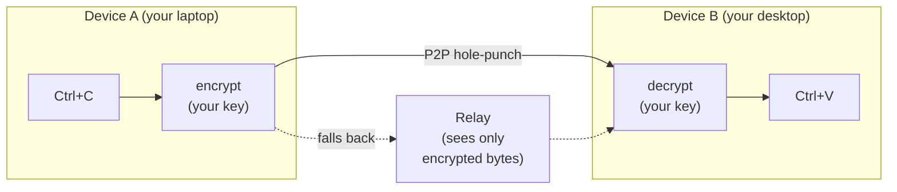

## Project Overview

English | [简体中文](./README_ZH.md)

> **Copy on one device. Paste on another — even across the internet.**
>
> No cloud account. No third-party servers. Your clipboard never leaves your devices in a form anyone else can read.

UniClipboard is a **privacy-first**, cross-device clipboard synchronization tool.
It enables seamless and secure syncing of text, images, and files across multiple devices, whether on the same Wi-Fi or across different networks. Data is encrypted both in transit and at rest, and decrypted only on the user’s devices—neither servers nor the network layer can ever access plaintext data.


<p align="center">
  <video src="https://github.com/user-attachments/assets/367c7f45-579a-49b7-bc96-9ccc25cf5ad0" controls muted playsinline width="800"></video>
  <br/>
  <em>Desktop ↔ desktop — real-time, bidirectional clipboard sync between two computers.</em>
</p>

<details>
  <summary><strong>Mobile companion (LAN)</strong> — share a screenshot from your phone to your desktop. (click to expand)</summary>
  <p align="center">
    <video src="https://github.com/user-attachments/assets/29f4bf5d-8996-4602-8784-067fb919c671" controls muted playsinline width="800"></video>
  </p>
</details>

<div align="center">
  <br/>

  <a href="https://github.com/UniClipboard/UniClipboard/releases">
    
  </a>
  <a href="https://github.com/UniClipboard/UniClipboard/releases">
    
  </a >
  <a href="https://github.com/UniClipboard/UniClipboard/releases">
    
  </a>
  <a href="#mobile-companion-lan">
    
  </a>
  <a href="#mobile-companion-lan">
    
  </a>

  <div>
    <a href="./LICENSE">
      
    </a >
    <a href="https://github.com/UniClipboard/UniClipboard/releases">
      
    </a >
    <a href="https://codecov.io/gh/UniClipboard/UniClipboard" >
      
    </a>
  </div>

</div>

> [!WARNING]
> UniClipboard is currently under active development and may have unstable or missing features. Feel free to try it out and provide feedback!

## Features

- **Cross-platform**: First-class support on Windows, macOS, and Linux — your clipboard works wherever you do. iPhone and Android can join as a **LAN companion** (see below).
- **Cross-network sync**: Real-time sync on the same Wi-Fi, across different home/office networks, or across the internet, with automatic NAT traversal and encrypted relay fallback — not just LAN, and not bound to a single network. (Desktop ↔ desktop; mobile is same-Wi-Fi only.)
- **Mobile companion (LAN)**: Pair an iPhone with the **UniClipboard iOS App** (now in [TestFlight public beta](https://testflight.apple.com/join/nyNQ8dQe)) — or stay on the bundled **iOS Shortcut** — and on Android install the **[UniClipboard Android client](https://github.com/UniClipboard/uc-android)** ([download APK](https://github.com/UniClipboard/uc-android/releases/latest)), a fork of [**SyncClipboard**](https://github.com/Jeric-X/SyncClipboard) and protocol-compatible with any other SyncClipboard client. Bidirectional clipboard exchange on the local network. QR-code pairing, per-device credentials, rotate passwords without re-pairing.
- **Encrypted spaces**: Devices join a shared "space" with one invitation code + passphrase — no cloud account, no email, just two devices agreeing to trust each other.
- **Local full-text search**: Search your full history in milliseconds, even with tens of thousands of entries — and the index itself stays encrypted on disk.
- **Text, images, and files**: Copy on one device, paste on another. Large files use streaming transfer so they don't have to fit in memory.
- **Quick Panel**: Keyboard-shortcut overlay with inline preview for text, links, images, code, and files — designed to feel like part of the OS clipboard, not a separate app you context-switch into.
- **Command-line tool**: A `uniclip` CLI mirrors the GUI flow and works headlessly — built for terminals, SSH sessions, scripts, and tmux workflows.
- **Secure encryption**: XChaCha20-Poly1305 AEAD keeps data encrypted in transit and at rest — even the relay only sees ciphertext.
- **Multi-device management**: Manage paired devices, presence, and per-device sync preferences. Revoke a lost device from any other paired one — sync stops including it immediately.

## Installation

### Download from Releases

Visit the [GitHub Releases](https://github.com/UniClipboard/UniClipboard/releases) page to download the installation package for your operating system.

### One-line install script (Linux / macOS)

Don't want to pick a package by hand? One command does it:

```bash
curl -fsSL https://uniclipboard.app/install.sh | bash
```

The script detects OS and CPU automatically:

- **macOS** — downloads `.app.tar.gz`, extracts it, and moves `UniClipboard.app` into `/Applications` (escalates with `sudo` if the directory isn't writable; pass `--prefix "$HOME/Applications"` for a user-level install).
- **Linux** — with sudo, installs `.deb` via `apt` or `.rpm` via `dnf`/`yum`; otherwise falls back to AppImage in `~/.local/bin` with a `.desktop` entry (no root needed).

Common flags:

```bash
# Pin a specific version
curl -fsSL https://uniclipboard.app/install.sh | bash -s -- --version v0.9.0

# Force AppImage (rootless even when sudo is available)
curl -fsSL https://uniclipboard.app/install.sh | bash -s -- --format appimage
```

Uninstall with the matching script:

```bash
# Remove the app only, keep data and config
curl -fsSL https://raw.githubusercontent.com/UniClipboard/UniClipboard/main/scripts/uninstall.sh | bash

# Full wipe — also removes data directories, config, and cache
curl -fsSL https://raw.githubusercontent.com/UniClipboard/UniClipboard/main/scripts/uninstall.sh | bash -s -- --purge

# Preview what would be removed without deleting anything
curl -fsSL https://raw.githubusercontent.com/UniClipboard/UniClipboard/main/scripts/uninstall.sh | bash -s -- --dry-run
```

> Update behavior matches the manual download paths below: `.deb` / `.rpm` installs are not picked up by the in-app updater — re-run the script or use your system package manager. AppImage on Linux and `.app` on macOS continue to update from inside the app.

### Linux

Each release ships `.deb`, `.rpm`, and `.AppImage` artifacts for both `x86_64` and `aarch64` (where supported).

**Fedora / RHEL / openSUSE — via COPR (recommended, auto-updating)**

```bash
sudo dnf copr enable mkdir700/uniclipboard-alpha   # alpha channel; or mkdir700/uniclipboard for stable
sudo dnf install uniclipboard
```

After enabling, `sudo dnf upgrade` will pick up new releases automatically.

**Or download a single .rpm / .deb / AppImage from the Releases page:**

```bash
# Debian / Ubuntu
sudo dpkg -i uniclipboard_<version>_amd64.deb
sudo apt-get install -f                                 # resolve missing deps if any

# Fedora / RHEL / openSUSE (one-shot, no COPR)
sudo dnf install ./UniClipboard-<version>-1.x86_64.rpm

# AppImage (any distro)
chmod +x UniClipboard_<version>_amd64.AppImage
./UniClipboard_<version>_amd64.AppImage
```

> Packaged installs (COPR / one-shot rpm / deb) do not auto-update from inside the app — use `dnf upgrade` / `apt upgrade` against your package source. The AppImage is what the in-app updater uses on Linux.

### Homebrew (macOS)

On macOS, install via the official tap [`UniClipboard/homebrew-tap`](https://github.com/UniClipboard/homebrew-tap):

```bash
brew tap UniClipboard/tap

# Desktop app (.app bundle)
brew install --cask uniclipboard

# CLI only — installs the `uniclip` command
brew install uniclipboard
```

Or install in a single command without tapping first:

```bash
brew install --cask UniClipboard/tap/uniclipboard   # GUI
brew install UniClipboard/tap/uniclipboard          # CLI
```

The cask and the formula can coexist — install both if you want the GUI plus the `uniclip` command.

### Build from Source

```bash
# Clone the repository (`--recurse-submodules` pulls the iroh-blobs fork
# under src-tauri/vendor/iroh-blobs/; without it `cargo build` fails).
git clone --recurse-submodules https://github.com/UniClipboard/UniClipboard.git
cd UniClipboard

# Install dependencies
bun install

# Start development mode
bun tauri dev

# Build application
bun tauri build
```

## Usage

### First Device (Create a Space)

1. Launch the app and choose **Create a Space**
2. Set an encryption passphrase — this protects all data inside the space
3. Done. Copied content is stored encrypted in this space.

### Adding More Devices (Join via Invitation)

1. On an existing device, open the **Devices** page and **generate an invitation code** (short-lived, valid for several minutes)
2. On the new device, choose **Join an existing space**, enter the invitation code together with the space passphrase
3. Once verified, the device joins and syncing starts automatically.

> Already set up and want to move to another space? Use **Switch space** from the Devices page (or `uniclip switch-space` from the CLI) — your local clipboard history is re-encrypted and migrated.

### Pair a Mobile Device (LAN companion) <a id="mobile-companion-lan"></a>

The **UniClipboard iOS App is now in [TestFlight public beta](https://testflight.apple.com/join/nyNQ8dQe)**. On Android, install the **[UniClipboard Android client](https://github.com/UniClipboard/uc-android)** — a fork of [SyncClipboard](https://github.com/Jeric-X/SyncClipboard) that ships APKs in [releases](https://github.com/UniClipboard/uc-android/releases/latest); any other SyncClipboard-compatible client also works. Either way, the phone joins as a **LAN companion** — the desktop daemon exposes a small SyncClipboard-compatible HTTP service on your local network, and the phone reads/writes the clipboard against it.

1. On the desktop, open **Devices → Mobile sync**, enable it, and pick the LAN IPv4 the phone will reach (don't print `0.0.0.0` / `Auto` onto a phone screen).
2. Click **Add device** to generate a QR code with the listener URL, username, and one-time password.
3. **iPhone** — install **TestFlight** from the App Store, then open `https://testflight.apple.com/join/nyNQ8dQe` to accept the invite and install the **UniClipboard iOS App**; enter the desktop's URL + credentials in the app. The bundled iOS Shortcut (installed by scanning the QR) still works as a fallback.
   > ⚠️ If TestFlight shows a certificate error, or the **Install** button spins because TestFlight can't reach App Store Connect, **temporarily disable your proxy / VPN client** (Loon, Surge, Clash, etc. — including global rules, TUN, HTTPS decryption / MitM) so TestFlight goes direct. Re-enable it after the app is installed.
4. **Android** — install the [**UniClipboard Android client**](https://github.com/UniClipboard/uc-android) (APK in [releases](https://github.com/UniClipboard/uc-android/releases/latest)), or use any other SyncClipboard-compatible client, and enter the same URL and credentials.
5. Copy on either side; the other side picks it up over Wi-Fi.

Limitations (today):

- **Same Wi-Fi only** — mobile doesn't NAT-hole-punch or go through the relay. Off-LAN, mobile clients can't reach the desktop.
- **Plain HTTP + Basic Auth on the LAN** — TLS is planned for v2. Only enable the listener on networks you trust.
- **Mobile is not a space peer** — it doesn't get a node ID and can't read the encrypted history database; it only exchanges the current clipboard.
- **iOS has no silent background sync** — iOS doesn't grant apps a general-purpose background clipboard hook, so the iOS app receives/sends only while it's in the foreground (or via notification tap). This is a platform restriction, not a missing feature; even WeChat's keyboard can only sync clipboard at the moment it's invoked. See [FAQ — iOS background sync](https://www.uniclipboard.app/docs/faq#why-cant-the-ios-app-sync-clipboard-silently-in-the-background-like-the-desktop).

See the [Mobile sync guide](https://www.uniclipboard.app/docs/guides/mobile-sync) for the full setup flow.

### Main Pages

- **Dashboard** — Clipboard history with full-text search and detailed preview
- **Quick Panel** — Keyboard-shortcut overlay for fast clipboard access
- **Devices** — Manage paired desktops and mobile clients, presence, invitation codes, QR pairing, switch spaces
- **Settings** — General, sync, security, network, storage, and search-index options

## Advanced Features

### How it Works



- **Pairing**: Devices exchange a public key once, locally — no cloud account, no email.
- **Transport**: Direct connection when devices can reach each other (same Wi-Fi or via NAT hole-punching across home/office networks); falls back to an encrypted relay otherwise.
- **Encryption**: Payload encryption is independent of the transport — even a malicious relay only sees ciphertext.
- **Storage**: Local history is encrypted at rest, and the search index is encrypted too.
- **Resilience**: Connections recover automatically after Wi-Fi switches, sleep/wake, or brief disconnects — no re-pairing required.

### Command-line Tool

The `uniclip` CLI mirrors the GUI flow and works headlessly (e.g. on servers):

```bash
uniclip init                    # Create a new encrypted space on this device
uniclip invite                  # Generate a short-lived invitation code
uniclip join <code>             # Join an existing space
uniclip members                 # List paired devices and presence
uniclip send "hello"            # Send clipboard content to other devices
uniclip watch                   # Stream incoming clipboard events
uniclip switch-space            # Move this device to another space
uniclip status / start / stop   # Daemon lifecycle
```

### Privacy & Security

**What we collect** — Anonymous telemetry to help improve the app — never your clipboard content or any of your personal data. You can turn it off anytime in **Settings**, and we fully respect that choice.

**What a relay can see** — Encrypted bytes and connection metadata (source / destination peer IDs). It can't decrypt your content, ever.

**What's stored on disk** — An encrypted SQLite database, plus a search index designed so full-text search works without exposing plaintext.

**If you lose a device** — Revoke it from any other paired device. Future syncs will exclude it immediately.

**You can audit it** — Every line, including the cryptography, lives on GitHub. Trust the code, not the marketing.

#### Cryptography details

- **End-to-end encryption**: Data is encrypted in transit between devices and remains encrypted at rest in local storage.
- **XChaCha20-Poly1305 AEAD** — modern authenticated encryption.
  - 24-byte random nonce effectively eliminates nonce-reuse risk
  - 32-byte (256-bit) encryption key
  - Provides ciphertext integrity and authenticity verification
- **Argon2id key derivation** — securely derives encryption keys from your passphrase.
  - Memory cost: 128 MB · Iterations: 3 · Parallelism: 4 threads
  - Resistant to GPU / ASIC cracking attacks
- **Layered key architecture**:
  - MasterKey encrypts clipboard content
  - Key Encryption Key (KEK) is derived from your passphrase via Argon2id
  - KEK is stored in the system keyring (macOS Keychain, Windows Credential Manager, Linux Secret Service)
  - MasterKey is encrypted and stored in a KeySlot file
- **Per-space isolation**: Each space has its own MasterKey; switching to another space re-encrypts local history under the new space's MasterKey.
- **Device authorization**: Precise control over each paired device's access permissions.

## FAQ

**Why not just use iCloud Universal Clipboard?**
If you only use Apple devices, don't need history, and fully trust Apple's closed-source end-to-end encryption — iCloud is fine. The moment you add a Windows or Linux machine, want a searchable history, or want to verify the encryption yourself, you need something else.

**Why not a self-hosted clipboard sync (e.g. ClipCascade)?**
Self-hosted means you have to run a server. UniClipboard works out of the box — direct P2P first, encrypted relay only as a fallback. You never have to operate any infrastructure.

**Does it work fully offline / LAN-only?**
Yes. Devices on the same Wi-Fi connect directly without going through the relay. Even if the relay is unreachable, devices on the same network keep syncing.

**Where does my clipboard history actually live?**
Only on your devices. Local storage is encrypted at rest with a key that never leaves the device's system keyring. No UniClipboard server ever receives or stores your clipboard content.

**Is there a mobile app?**
On iOS, yes — the **UniClipboard iOS App is now in TestFlight public beta**. Install TestFlight from the App Store, then open [testflight.apple.com/join/nyNQ8dQe](https://testflight.apple.com/join/nyNQ8dQe) to accept the invite and install the build. On Android, install the [**UniClipboard Android client**](https://github.com/UniClipboard/uc-android) — a fork of [SyncClipboard](https://github.com/Jeric-X/SyncClipboard) with APKs in [releases](https://github.com/UniClipboard/uc-android/releases/latest); any other SyncClipboard-compatible client also works. Either way, mobile runs as a **LAN companion**: the desktop daemon exposes a SyncClipboard-compatible HTTP endpoint and the phone talks to it with a base URL + Basic Auth. It's bidirectional and same-Wi-Fi only — no NAT traversal, no relay. The bundled iOS Shortcut still works as a fallback. See the [Pair a Mobile Device](#mobile-companion-lan) section above.

## Contributing

Contributions of all kinds are welcome! Please read [CONTRIBUTING.md](./CONTRIBUTING.md) for the full development setup, branching strategy, commit conventions, and PR process.

Quick start:

1. Fork this repository
2. Create your feature branch (`git checkout -b feature/amazing-feature`)
3. Commit your changes following the project's [commit conventions](./CONTRIBUTING.md#commit-conventions)
4. Push to the branch (`git push origin feature/amazing-feature`)
5. Open a Pull Request against the `main` branch

## License

This project is licensed under the AGPL-3.0 License - see the [LICENSE](./LICENSE) file for details.

## Acknowledgments

- [Tauri](https://tauri.app) - Cross-platform application framework
- [React](https://react.dev) - Frontend UI development framework
- [Rust](https://www.rust-lang.org) - Safe and efficient backend implementation language
- [iroh](https://www.iroh.computer) - QUIC-based P2P networking that powers cross-network direct connections and blob transfer
- [Tokio](https://tokio.rs) - Asynchronous runtime that drives every networking and I/O path
- [shadcn/ui](https://ui.shadcn.com) - Composable component recipes built on Radix UI
- [Radix UI](https://www.radix-ui.com) - Unstyled, accessible primitives behind the desktop interface
- [Tailwind CSS](https://tailwindcss.com) - Utility-first styling for the entire UI
- [SQLite](https://www.sqlite.org) - Embedded database that stores clipboard history locally

---

**Have questions or suggestions?** [Create an Issue](https://github.com/UniClipboard/UniClipboard/issues/new) or contact us to discuss!
