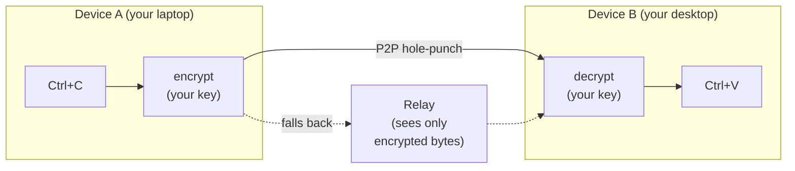

## Project Overview

English | [简体中文](./README_ZH.md)

> **Copy on one device. Paste on another — even across the internet.**
>
> No cloud account. No third-party servers. Your clipboard never leaves your devices in a form anyone else can read.

UniClipboard is a **privacy-first**, cross-device clipboard synchronization tool.
It enables seamless and secure syncing of text, images, and files across multiple devices, whether on the same Wi-Fi or across different networks. Data is encrypted both in transit and at rest, and decrypted only on the user’s devices—neither servers nor the network layer can ever access plaintext data.


<p align="center">
  <video src="https://github.com/user-attachments/assets/2775e733-c92b-41e5-b842-8173c206ad61" controls muted playsinline width="800"></video>
</p>

<div align="center">
  <br/>

  <a href="https://github.com/UniClipboard/UniClipboard/releases">
    
  </a>
  <a href="https://github.com/UniClipboard/UniClipboard/releases">
    
  </a >
  <a href="https://github.com/UniClipboard/UniClipboard/releases">
    
  </a>

  <div>
    <a href="./LICENSE">
      
    </a >
    <a href="https://github.com/UniClipboard/UniClipboard/releases">
      
    </a >
    <a href="https://codecov.io/gh/UniClipboard/UniClipboard" >
      
    </a>
  </div>

</div>

> [!WARNING]
> UniClipboard is currently under active development and may have unstable or missing features. Feel free to try it out and provide feedback!

## Features

- **Cross-platform**: First-class support on Windows, macOS, and Linux — your clipboard works wherever you do.
- **Cross-network sync**: Real-time sync on the same Wi-Fi, across different home/office networks, or across the internet, with automatic NAT traversal and encrypted relay fallback — not just LAN, and not bound to a single network.
- **Encrypted spaces**: Devices join a shared "space" with one invitation code + passphrase — no cloud account, no email, just two devices agreeing to trust each other.
- **Local full-text search**: Search your full history in milliseconds, even with tens of thousands of entries — and the index itself stays encrypted on disk.
- **Text, images, and files**: Copy on one device, paste on another. Large files use streaming transfer so they don't have to fit in memory.
- **Quick Panel**: Keyboard-shortcut overlay with inline preview for text, links, images, code, and files — designed to feel like part of the OS clipboard, not a separate app you context-switch into.
- **Command-line tool**: A `uniclip` CLI mirrors the GUI flow and works headlessly — built for terminals, SSH sessions, scripts, and tmux workflows.
- **Secure encryption**: XChaCha20-Poly1305 AEAD keeps data encrypted in transit and at rest — even the relay only sees ciphertext.
- **Multi-device management**: Manage paired devices, presence, and per-device sync preferences. Revoke a lost device from any other paired one — sync stops including it immediately.

## Installation

### Download from Releases

Visit the [GitHub Releases](https://github.com/UniClipboard/UniClipboard/releases) page to download the installation package for your operating system.

### Homebrew (macOS)

On macOS, install via the official tap [`UniClipboard/homebrew-tap`](https://github.com/UniClipboard/homebrew-tap):

```bash
brew tap UniClipboard/tap

# Desktop app (.app bundle)
brew install --cask uniclipboard

# CLI only — installs the `uniclip` command
brew install uniclipboard
```

Or install in a single command without tapping first:

```bash
brew install --cask UniClipboard/tap/uniclipboard   # GUI
brew install UniClipboard/tap/uniclipboard          # CLI
```

The cask and the formula can coexist — install both if you want the GUI plus the `uniclip` command.

### Build from Source

```bash
# Clone the repository
git clone https://github.com/UniClipboard/UniClipboard.git
cd UniClipboard

# Install dependencies
bun install

# Start development mode
bun tauri dev

# Build application
bun tauri build
```

## Usage

### First Device (Create a Space)

1. Launch the app and choose **Create a Space**
2. Set an encryption passphrase — this protects all data inside the space
3. Done. Copied content is stored encrypted in this space.

### Adding More Devices (Join via Invitation)

1. On an existing device, open the **Devices** page and **generate an invitation code** (short-lived, valid for several minutes)
2. On the new device, choose **Join an existing space**, enter the invitation code together with the space passphrase
3. Once verified, the device joins and syncing starts automatically.

> Already set up and want to move to another space? Use **Switch space** from the Devices page (or `uniclip switch-space` from the CLI) — your local clipboard history is re-encrypted and migrated.

### Main Pages

- **Dashboard** — Clipboard history with full-text search and detailed preview
- **Quick Panel** — Keyboard-shortcut overlay for fast clipboard access
- **Devices** — Manage paired devices and presence, generate invitation codes, switch spaces
- **Settings** — General, sync, security, network, storage, and search-index options

## Advanced Features

### How it Works



- **Pairing**: Devices exchange a public key once, locally — no cloud account, no email.
- **Transport**: Direct connection when devices can reach each other (same Wi-Fi or via NAT hole-punching across home/office networks); falls back to an encrypted relay otherwise.
- **Encryption**: Payload encryption is independent of the transport — even a malicious relay only sees ciphertext.
- **Storage**: Local history is encrypted at rest, and the search index is encrypted too.
- **Resilience**: Connections recover automatically after Wi-Fi switches, sleep/wake, or brief disconnects — no re-pairing required.

### Command-line Tool

The `uniclip` CLI mirrors the GUI flow and works headlessly (e.g. on servers):

```bash
uniclip init                    # Create a new encrypted space on this device
uniclip invite                  # Generate a short-lived invitation code
uniclip join <code>             # Join an existing space
uniclip members                 # List paired devices and presence
uniclip send "hello"            # Send clipboard content to other devices
uniclip watch                   # Stream incoming clipboard events
uniclip switch-space            # Move this device to another space
uniclip status / start / stop   # Daemon lifecycle
```

### Privacy & Security

**What we collect** — Anonymous telemetry to help improve the app — never your clipboard content or any of your personal data. You can turn it off anytime in **Settings**, and we fully respect that choice.

**What a relay can see** — Encrypted bytes and connection metadata (source / destination peer IDs). It can't decrypt your content, ever.

**What's stored on disk** — An encrypted SQLite database, plus a search index designed so full-text search works without exposing plaintext.

**If you lose a device** — Revoke it from any other paired device. Future syncs will exclude it immediately.

**You can audit it** — Every line, including the cryptography, lives on GitHub. Trust the code, not the marketing.

#### Cryptography details

- **End-to-end encryption**: Data is encrypted in transit between devices and remains encrypted at rest in local storage.
- **XChaCha20-Poly1305 AEAD** — modern authenticated encryption.
  - 24-byte random nonce effectively eliminates nonce-reuse risk
  - 32-byte (256-bit) encryption key
  - Provides ciphertext integrity and authenticity verification
- **Argon2id key derivation** — securely derives encryption keys from your passphrase.
  - Memory cost: 128 MB · Iterations: 3 · Parallelism: 4 threads
  - Resistant to GPU / ASIC cracking attacks
- **Layered key architecture**:
  - MasterKey encrypts clipboard content
  - Key Encryption Key (KEK) is derived from your passphrase via Argon2id
  - KEK is stored in the system keyring (macOS Keychain, Windows Credential Manager, Linux Secret Service)
  - MasterKey is encrypted and stored in a KeySlot file
- **Per-space isolation**: Each space has its own MasterKey; switching to another space re-encrypts local history under the new space's MasterKey.
- **Device authorization**: Precise control over each paired device's access permissions.

## FAQ

**Why not just use iCloud Universal Clipboard?**
If you only use Apple devices, don't need history, and fully trust Apple's closed-source end-to-end encryption — iCloud is fine. The moment you add a Windows or Linux machine, want a searchable history, or want to verify the encryption yourself, you need something else.

**Why not a self-hosted clipboard sync (e.g. ClipCascade)?**
Self-hosted means you have to run a server. UniClipboard works out of the box — direct P2P first, encrypted relay only as a fallback. You never have to operate any infrastructure.

**Does it work fully offline / LAN-only?**
Yes. Devices on the same Wi-Fi connect directly without going through the relay. Even if the relay is unreachable, devices on the same network keep syncing.

**Where does my clipboard history actually live?**
Only on your devices. Local storage is encrypted at rest with a key that never leaves the device's system keyring. No UniClipboard server ever receives or stores your clipboard content.

**I upgraded from an older version — why are my devices not paired anymore?**
The 0.6 release replaced the underlying networking stack. Existing pairings from earlier versions are no longer valid; re-pairing once via the **Devices** page (or `uniclip invite` / `uniclip join`) restores sync.

## Contributing

Contributions of all kinds are welcome! If you're interested in improving UniClipboard:

1. Fork this repository
2. Create your feature branch (`git checkout -b feature/amazing-feature`)
3. Commit your changes (`git commit -m 'Add some amazing feature'`)
4. Push to the branch (`git push origin feature/amazing-feature`)
5. Create a Pull Request

## License

This project is licensed under the AGPL-3.0 License - see the [LICENSE](./LICENSE) file for details.

## Acknowledgments

- [Tauri](https://tauri.app) - Cross-platform application framework
- [React](https://react.dev) - Frontend UI development framework
- [Rust](https://www.rust-lang.org) - Safe and efficient backend implementation language
- [iroh](https://www.iroh.computer) - QUIC-based P2P networking that powers cross-network direct connections and blob transfer
- [Tokio](https://tokio.rs) - Asynchronous runtime that drives every networking and I/O path
- [shadcn/ui](https://ui.shadcn.com) - Composable component recipes built on Radix UI
- [Radix UI](https://www.radix-ui.com) - Unstyled, accessible primitives behind the desktop interface
- [Tailwind CSS](https://tailwindcss.com) - Utility-first styling for the entire UI
- [SQLite](https://www.sqlite.org) - Embedded database that stores clipboard history locally

---

**Have questions or suggestions?** [Create an Issue](https://github.com/UniClipboard/UniClipboard/issues/new) or contact us to discuss!
