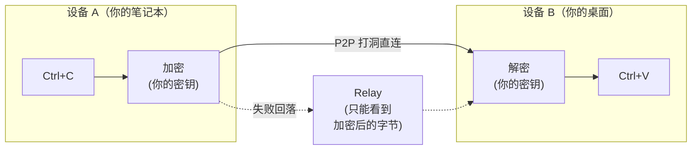
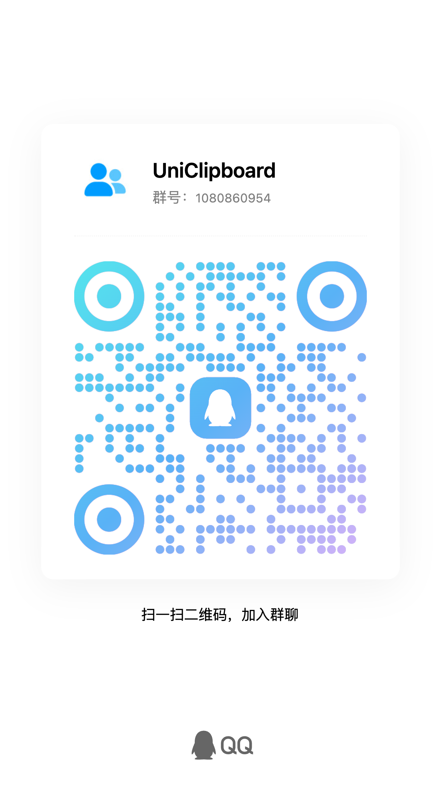

## 项目介绍

[English](./README.md) | 简体中文

> **一台设备 Ctrl+C，另一台设备 Ctrl+V —— 哪怕跨着一整个互联网。**
>
> 无需云账号，无需第三方服务器。你的剪贴板从未以任何人能读懂的形式离开过你的设备。

UniClipboard 是一款以 **隐私优先** 为核心理念的跨设备剪贴板同步工具。它支持在多台设备之间无缝、安全地同步文本、图片和文件，无论设备处于同一 Wi-Fi 还是不同网络环境。数据在传输与本地存储阶段均保持加密，仅在用户设备本地解密，服务器与网络层永远无法访问明文。


<p align="center">
  <video src="https://github.com/user-attachments/assets/367c7f45-579a-49b7-bc96-9ccc25cf5ad0" controls muted playsinline width="800"></video>
  <br/>
  <em>桌面端 ↔ 桌面端：两台电脑之间实时双向同步剪贴板。</em>
</p>

<details>
  <summary><strong>移动配套</strong> —— 在手机上分享截图到电脑。（点击展开）</summary>
  <p align="center">
    <video src="https://github.com/user-attachments/assets/29f4bf5d-8996-4602-8784-067fb919c671" controls muted playsinline width="800"></video>
  </p>
</details>

<div align="center">

  <br/>

  <a href="https://github.com/UniClipboard/UniClipboard/releases">
    
  </a>  
  <a href="https://github.com/UniClipboard/UniClipboard/releases">
    
  </a>
  <a href="https://github.com/UniClipboard/UniClipboard/releases">
    
  </a>
  <a href="#mobile-companion-lan">
    
  </a>
  <a href="#mobile-companion-lan">
    
  </a>

  <div>
    <a href="./LICENSE">
      
    </a>
    <a href="https://github.com/UniClipboard/UniClipboard/releases">
      
    </a>
    <a href="https://codecov.io/gh/UniClipboard/UniClipboard" >
      
    </a>
  </div>

</div>

> [!WARNING]
> UniClipboard 目前处于积极开发阶段，可能存在功能不稳定或缺失的情况。欢迎体验并提供反馈！

## 功能特点

- **跨平台支持**: Windows、macOS 和 Linux 三端均为一等公民 —— 你的剪贴板跟着你在哪都能用。iPhone 与 Android 可以作为 **伴侣** 接入（见下文）。
- **跨网络同步**: 同一 Wi-Fi、不同家庭/办公室网络、甚至跨广域网均可实时同步，自动 NAT 穿透与加密中继回落 —— 不再局限于局域网，也不绑定单一网络。（桌面 ↔ 桌面适用；手机是伴侣 —— 默认走 LAN，也可经 server 节点或 Tailscale 跨网络。）
- **移动端伴侣**: iPhone 推荐安装 **UniClipboard iOS App**（目前 [TestFlight beta 公测中](https://testflight.apple.com/join/nyNQ8dQe)），也可继续用内置的 **iOS Shortcut**；Android 装 **[UniClipboard Android 客户端](https://github.com/UniClipboard/uc-android)**（[下载 APK](https://github.com/UniClipboard/uc-android/releases/latest)），它 fork 自 [**SyncClipboard**](https://github.com/Jeric-X/SyncClipboard)，协议兼容，因此其他任意 SyncClipboard 客户端也能接入。与桌面双向交换剪贴 —— 默认走 LAN，也可经 server 节点或 Tailscale 跨网络。支持二维码配对、每台手机独立凭证，密码可在不解绑设备的情况下轮换。
- **加密空间**: 设备通过邀请码 + 口令加入同一个"空间" —— 不需要云账号、不需要邮箱，只需要两台设备相互信任。
- **本地加密全文搜索**: 在数万条历史中也能毫秒级检索，索引本身在磁盘上同样加密 —— "本地存储"不等于"安全存储"，"本地加密存储"才是。
- **文本、图片、文件**: 在一台设备复制，在另一台设备粘贴。大文件采用流式传输，不需要先装进内存。
- **快捷面板**: 通过键盘快捷键唤出，内嵌文本、链接、图片、代码与文件的预览 —— 像系统剪贴板的一部分，而不是一个需要上下文切换的独立应用。
- **命令行工具**: `uniclip` CLI 与 GUI 流程一致并可在无桌面环境下使用 —— 为终端、SSH 会话、脚本、tmux 工作流而生。
- **安全加密**: XChaCha20-Poly1305 AEAD 在传输与本地存储全程加密 —— 即便流量经过中继，中继也只能看到密文。
- **多设备管理**: 管理已配对设备、在线状态与每台设备的同步偏好。设备丢了？在任何一台已配对的设备上吊销，后续同步会立即把它排除在外。

## 安装方法

### 从 Releases 下载

访问 [GitHub Releases](https://github.com/UniClipboard/UniClipboard/releases) 页面，下载适合您操作系统的安装包。

### 一键安装脚本（Linux / macOS）

不想手动挑包？一行命令搞定：

```bash
curl -fsSL https://uniclipboard.app/install.sh | bash
```

脚本会自动识别系统与架构：

- **macOS** —— 下载 `.app.tar.gz`，解压后搬到 `/Applications/UniClipboard.app`（写权限不足时自动调用 sudo；也可用 `--prefix "$HOME/Applications"` 走用户级安装）。
- **Linux** —— 有 sudo 时优先用 `apt`/`dnf`/`yum` 安装 `.deb` 或 `.rpm`；都不可用则回退到 AppImage（装到 `~/.local/bin` 并注册 `.desktop`，无需 root）。

常用选项：

```bash
# 锁定版本
curl -fsSL https://uniclipboard.app/install.sh | bash -s -- --version v0.9.0

# 强制 AppImage（即使有 sudo，也免 root 装到用户目录）
curl -fsSL https://uniclipboard.app/install.sh | bash -s -- --format appimage
```

卸载使用对应的卸载脚本：

```bash
# 仅删应用本体，保留数据/配置
curl -fsSL https://raw.githubusercontent.com/UniClipboard/UniClipboard/main/scripts/uninstall.sh | bash

# 彻底清除（含数据目录、配置、缓存）
curl -fsSL https://raw.githubusercontent.com/UniClipboard/UniClipboard/main/scripts/uninstall.sh | bash -s -- --purge

# 预览将要删除的内容，不实际删除
curl -fsSL https://raw.githubusercontent.com/UniClipboard/UniClipboard/main/scripts/uninstall.sh | bash -s -- --dry-run
```

> 通过这种方式安装的版本，更新策略与下文的单文件下载相同：`.deb` / `.rpm` 不会从 App 内更新器升级，请重跑安装脚本或走系统包管理器；AppImage 与 macOS `.app` 仍由 App 内更新器接管。

### Linux

每次发布都会同时构建 `.deb`、`.rpm` 与 `.AppImage` 三种格式，覆盖 `x86_64` 与 `aarch64`（如平台支持）。

**Fedora / RHEL / openSUSE — 推荐 COPR 仓库（自动跟随版本更新）**

```bash
sudo dnf copr enable mkdir700/uniclipboard-alpha   # alpha 渠道；正式版请用 mkdir700/uniclipboard
sudo dnf install uniclipboard
```

启用后 `sudo dnf upgrade` 会自动拉取新版本。

**或者从 Releases 页面单独下载 .rpm / .deb / AppImage：**

```bash
# Debian / Ubuntu
sudo dpkg -i uniclipboard_<version>_amd64.deb
sudo apt-get install -f                                 # 如有缺失依赖，由 apt 补齐

# Fedora / RHEL / openSUSE（一次性手动安装）
sudo dnf install ./UniClipboard-<version>-1.x86_64.rpm

# AppImage（任意发行版）
chmod +x UniClipboard_<version>_amd64.AppImage
./UniClipboard_<version>_amd64.AppImage
```

> 经包管理器（COPR / dnf / apt）安装的版本不会通过 App 内的更新器自动升级，请用 `dnf upgrade` / `apt upgrade` 走系统包管理器。Linux 上 App 内更新器只对 AppImage 生效。

### Homebrew（macOS）

macOS 用户可以通过官方 tap [`UniClipboard/homebrew-tap`](https://github.com/UniClipboard/homebrew-tap) 安装：

```bash
brew tap UniClipboard/tap

# 桌面应用（.app）
brew install --cask uniclipboard

# 仅安装 CLI，命令名为 `uniclip`
brew install uniclipboard
```

也可以省去 `brew tap`，一行直装：

```bash
brew install --cask UniClipboard/tap/uniclipboard   # GUI
brew install UniClipboard/tap/uniclipboard          # CLI
```

GUI 和 CLI 互不冲突，需要的话两个都装即可。

### 从源码构建

```bash
# 克隆仓库（`--recurse-submodules` 会同步拉取 src-tauri/vendor/iroh-blobs/
# 下的 iroh-blobs fork，缺它 `cargo build` 会失败）
git clone --recurse-submodules https://github.com/UniClipboard/UniClipboard.git
cd UniClipboard

# 安装依赖
bun install

# 开发模式启动
bun tauri dev

# 构建应用
bun tauri build
```

## 使用说明

### 第一台设备（新建空间）

1. 首次启动应用，选择 **新建空间**
2. 设置加密口令 — 用于保护空间内的所有数据
3. 设置完成。复制的内容将以加密形式存储在该空间中

### 添加更多设备（通过邀请码加入）

1. 在已有设备上打开 **设备** 页，**生成邀请码**（短期有效，几分钟内可用）
2. 在新设备上启动应用，选择 **加入已有空间**，输入邀请码与空间口令
3. 口令验证通过后，新设备完成加入并自动开始同步

> 已经完成设置、想切换到另一个空间？在 **设备** 页使用 **切换空间**（或 CLI 中的 `uniclip switch-space`）—— 本地的剪贴板历史会被重新加密并迁移到新空间。

### 配对手机（伴侣） <a id="mobile-companion-lan"></a>

UniClipboard iOS App 目前在 [TestFlight beta 公测](https://testflight.apple.com/join/nyNQ8dQe)；Android 装 **[UniClipboard Android 客户端](https://github.com/UniClipboard/uc-android)**，它 fork 自 [SyncClipboard](https://github.com/Jeric-X/SyncClipboard)，APK 直接在 [releases 页](https://github.com/UniClipboard/uc-android/releases/latest)下载，其他任意兼容 SyncClipboard 协议的客户端也能接。无论用哪个客户端，手机都以 **HTTP 伴侣** 的形式接入：桌面 daemon 暴露一个兼容 SyncClipboard 的小型 HTTP 服务，手机直接读写它（默认走 LAN，也可经 server 节点或 Tailscale 跨网络）。

1. 桌面打开 **设备 → 移动端同步**，启用开关，并挑一块手机能拨通的 LAN IPv4 网卡（**别** 把 `0.0.0.0` / `Auto` 印到手机屏幕上）。
2. 点 **Add device**，生成包含监听 URL、用户名与一次性密码的二维码。
3. **iPhone** —— 推荐先在 **App Store** 装 **TestFlight**，再点开邀请链接 `https://testflight.apple.com/join/nyNQ8dQe` 接受邀请并安装 **UniClipboard iOS App**；App 里填入桌面给出的 URL 与凭据即可。也可以用相机扫码安装内置的 iOS Shortcut 作为备选。
   > ⚠️ 如果 TestFlight 报证书错误，或卡在「无法连接 App Store Connect」上，**先临时关掉 Loon / Surge / Clash 等代理梯子**（含全局规则、TUN、HTTPS 解密），让 TestFlight 走直连；装好 App 后再开梯子即可。
4. **Android** —— 装 [**UniClipboard Android 客户端**](https://github.com/UniClipboard/uc-android)（[APK 下载](https://github.com/UniClipboard/uc-android/releases/latest)），或任意其他兼容 SyncClipboard 协议的客户端，填同样的 URL 和凭证。
5. 任意一端复制，另一端通过 Wi-Fi 收到。

当前限制：

- **不走 P2P** —— 移动端不做 NAT 穿透、不走 relay，就是个普通 HTTP 客户端。默认在 LAN 下开箱即用，跨网络可经自建 server 节点（公网 HTTPS）或 Tailscale / VPN overlay。
- **监听器是明文 HTTP + Basic Auth** —— 放一层 TLS 反向代理（例如 server 节点）即可走 HTTPS；监听器原生 TLS 计划在 v2 引入。裸监听器只在你信任的网络上开启。
- **手机不是空间对端** —— 不分配 node ID，看不到加密历史数据库，只交换当下的剪贴。
- **iOS 没有静默后台同步** —— iOS 不给第三方 App 通用的后台剪贴板钩子，所以 iOS 端只在前台（或点开通知时）才能收发剪贴，做不到桌面那种常驻后台静默同步。这是系统层限制，不是功能缺失；连微信输入法也只能在键盘被调起的那一刻同步剪贴。详见 [FAQ — iOS 后台同步](https://www.uniclipboard.app/docs/zh/faq#ios-app-为什么不能像桌面那样在后台静默同步剪贴板)。

完整流程见 [移动端同步指南](https://www.uniclipboard.app/docs/zh/guides/mobile-sync)，或 [无头 server 节点指南](https://www.uniclipboard.app/docs/zh/guides/self-host-server-node) —— 让手机从任意网络都能经 HTTPS 访问。

### 主要页面

- **仪表盘** —— 剪贴板历史，支持全文搜索与详细预览
- **快捷面板** —— 通过键盘快捷键唤出的浮层，便于快速访问历史
- **设备** —— 管理已配对桌面与移动客户端、在线状态、邀请码、二维码配对、切换空间
- **设置** —— 配置通用、同步、安全、网络、存储与搜索索引等选项

## 高级功能

### 工作原理



- **配对**: 设备之间在本地交换一次公钥即可 —— 无需云账号、无需邮箱。
- **传输**: 设备能互相到达时直连（同一 Wi-Fi，或通过 NAT 打洞跨家庭/办公室网络），否则自动回落到加密中继。
- **加密**: 负载加密独立于传输层 —— 即便中继是恶意的，看到的也只是密文。
- **存储**: 本地历史加密存盘，搜索索引同样加密。
- **可恢复**: 切换 Wi-Fi、设备睡眠唤醒或短暂断网后，连接会自动恢复，无需重新配对。

### 命令行工具

`uniclip` 命令行工具与 GUI 流程一致，并可在无桌面环境（如服务器）下使用：

```bash
uniclip init                    # 在本机创建一个新的加密空间
uniclip invite                  # 生成短期邀请码
uniclip join <code>             # 通过邀请码加入已有空间
uniclip members                 # 列出已配对设备及在线状态
uniclip send "hello"            # 把内容发送到其他设备
uniclip watch                   # 实时接收来自其他设备的剪贴板内容
uniclip switch-space            # 把本机切换到另一个空间
uniclip status / start / stop   # 守护进程生命周期
```

### 隐私与安全

**我们收集什么** —— 仅收集匿名遥测数据用于帮助我们改进软件，绝不涉及你的剪贴板内容或任何个人数据。你可以随时在 **设置** 中关闭，我们完全尊重你的选择。

**Relay 能看到什么** —— 加密后的字节和连接元数据（源 / 目标 peer ID），永远无法解密你的内容。

**磁盘上存了什么** —— 一个加密的 SQLite 数据库，外加一个为支持搜索而建的索引 —— 全文搜索不会暴露明文。

**设备丢了怎么办** —— 在任意一台已配对的设备上吊销它，后续同步会立即把它排除。

**欢迎审计** —— 每一行代码（包括密码学相关部分）都在 GitHub 上。信任来自代码，不来自营销文案。

#### 密码学细节

- **端到端加密**: 数据在设备间传输时加密，且在本地存储阶段也保持加密。
- **XChaCha20-Poly1305 AEAD** —— 现代认证加密。
  - 24 字节随机 nonce，有效消除 nonce 重用风险
  - 32 字节（256 位）加密密钥
  - 提供密文完整性和真实性验证
- **Argon2id 密钥派生** —— 从用户口令安全派生加密密钥。
  - 内存成本：128 MB · 迭代次数：3 · 并行度：4 线程
  - 抗 GPU / ASIC 破解攻击
- **分层密钥架构**:
  - 主密钥（MasterKey）用于剪贴板内容加密
  - 密钥加密密钥（KEK）通过 Argon2id 从口令派生
  - KEK 安全存储于系统密钥环（macOS Keychain、Windows Credential Manager、Linux Secret Service）
  - 主密钥加密存储于 KeySlot 文件
- **空间隔离**: 每个空间拥有独立的主密钥；切换到另一个空间时，本地历史会用新空间的主密钥重新加密。
- **设备授权**: 精确控制每台已配对设备的访问权限。

## 常见问题

**直接用 iCloud 通用剪贴板不就行了？**
如果你只有 Apple 设备、不需要历史记录、并且完全信任 Apple 闭源的端到端加密 —— iCloud 没问题。但只要你多了一台 Windows 或 Linux、想要可搜索的历史、或想自己验证加密实现，就需要别的方案。

**为什么不用自托管的剪贴板同步（如 ClipCascade）？**
自托管要求你部署服务器。UniClipboard 装完就能用 —— 优先 P2P 直连，打洞失败才走加密 relay。你永远不需要运维任何基础设施。

**能不能纯局域网 / 离线使用？**
可以。同一 Wi-Fi 下的设备会直接互联，不经过中继。即使中继不可达，同一网络下的设备也能继续同步。

**我的剪贴板历史到底存在哪里？**
只在你自己的设备上。本地存储采用加密存盘，密钥从未离开过设备的系统密钥环。任何 UniClipboard 服务器都不会接收或保存你的剪贴板内容。

**有移动端 App 吗？**
iOS 侧 **UniClipboard iOS App 已开启 TestFlight beta 公测**：在 App Store 装好 TestFlight 后，打开 [testflight.apple.com/join/nyNQ8dQe](https://testflight.apple.com/join/nyNQ8dQe) 接受邀请并安装即可。Android 侧装 [**UniClipboard Android 客户端**](https://github.com/UniClipboard/uc-android)，它 fork 自 [SyncClipboard](https://github.com/Jeric-X/SyncClipboard)，APK 直接在 [releases 页](https://github.com/UniClipboard/uc-android/releases/latest)下载；其他任意兼容 SyncClipboard 协议的客户端也能接。无论用哪个客户端，移动端都以 **HTTP 伴侣** 的方式跑：桌面 daemon 暴露一个兼容 SyncClipboard 的 HTTP 端点，手机用 base URL + 凭据与之读写。双向同步；默认走 LAN，也可经 server 节点（公网 HTTPS）或 Tailscale 跨网络。移动端本身不打洞、不走 relay。具体步骤见上文 [配对手机](#mobile-companion-lan) 一节。

## 参与贡献

非常欢迎各种形式的贡献！开发环境搭建、分支策略、commit 规范、PR 流程的完整说明请参阅 [CONTRIBUTING_ZH.md](./CONTRIBUTING_ZH.md)（[English](./CONTRIBUTING.md)）。

快速上手：

1. Fork 本仓库
2. 创建您的特性分支 (`git checkout -b feature/amazing-feature`)
3. 按照项目的 [commit 规范](./CONTRIBUTING_ZH.md#commit-规范) 提交更改
4. 推送到分支 (`git push origin feature/amazing-feature`)
5. 向 `main` 分支提交 Pull Request

## 许可证

本项目采用 AGPL-3.0 许可证 - 详情请参阅 [LICENSE](./LICENSE) 文件。

## 鸣谢

- [Tauri](https://tauri.app) - 提供跨平台应用框架
- [React](https://react.dev) - 前端界面开发框架
- [Rust](https://www.rust-lang.org) - 安全高效的后端实现语言
- [iroh](https://www.iroh.computer) - 基于 QUIC 的 P2P 网络栈，支撑跨网络直连与块传输
- [Tokio](https://tokio.rs) - 驱动全部网络与 I/O 的 Rust 异步运行时
- [shadcn/ui](https://ui.shadcn.com) - 基于 Radix UI 的可组合组件方案
- [Radix UI](https://www.radix-ui.com) - 桌面界面背后的无样式、可访问组件原语
- [Tailwind CSS](https://tailwindcss.com) - 整套 UI 使用的 utility-first 样式方案
- [SQLite](https://www.sqlite.org) - 本地存储剪贴板历史的嵌入式数据库

## 交流群

扫描下方二维码加入交流群，和其他用户及开发者交流：

<table align="center">
  <tr>
    <td align="center"><strong>QQ 群</strong></td>
    <td align="center"><strong>微信群</strong></td>
  </tr>
  <tr>
    <td align="center"></td>
    <td align="center"></td>
  </tr>
</table>

---

💡 **有问题或建议？** [创建 Issue](https://github.com/UniClipboard/UniClipboard/issues/new) 或联系我们讨论！
