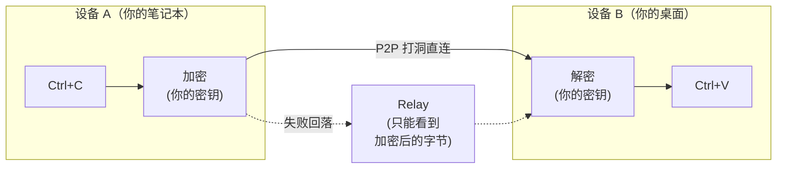

## 📝 项目介绍

[English](./README.md) | 简体中文

> **一台设备 Ctrl+C，另一台设备 Ctrl+V —— 哪怕跨着一整个互联网。**
>
> 无需云账号，无需第三方服务器。你的剪贴板从未以任何人能读懂的形式离开过你的设备。

UniClipboard 是一款以**隐私优先**为核心理念的跨设备剪贴板同步工具。它支持在多台设备之间无缝、安全地同步文本、图片和文件，无论设备处于同一 Wi-Fi 还是不同网络环境。数据在传输与本地存储阶段均保持加密，仅在用户设备本地解密，服务器与网络层永远无法访问明文。


<div align="center">

  <br/>

  <a href="https://github.com/UniClipboard/UniClipboard/releases">
    
  </a>  
  <a href="https://github.com/UniClipboard/UniClipboard/releases">
    
  </a>
  <a href="https://github.com/UniClipboard/UniClipboard/releases">
    
  </a>

  <div>
    <a href="./LICENSE">
      
    </a>
    <a href="https://github.com/UniClipboard/UniClipboard/releases">
      
    </a>
    <a href="https://codecov.io/gh/UniClipboard/UniClipboard" >
      
    </a>
  </div>

</div>

> [!WARNING]
> UniClipboard 目前处于积极开发阶段，可能存在功能不稳定或缺失的情况。欢迎体验并提供反馈！

## ✨ 功能特点

- **跨平台支持**: Windows、macOS 和 Linux 三端均为一等公民 —— 你的剪贴板跟着你在哪都能用。
- **跨网络同步**: 同一 Wi-Fi、不同家庭/办公室网络、甚至跨广域网均可实时同步，自动 NAT 穿透与加密中继回落 —— 不再局限于局域网，也不绑定单一网络。
- **加密空间**: 设备通过邀请码 + 口令加入同一个"空间" —— 不需要云账号、不需要邮箱，只需要两台设备相互信任。
- **本地加密全文搜索**: 在数万条历史中也能毫秒级检索，索引本身在磁盘上同样加密 —— "本地存储"不等于"安全存储"，"本地加密存储"才是。
- **文本、图片、文件**: 在一台设备复制，在另一台设备粘贴。大文件采用流式传输，不需要先装进内存。
- **快捷面板**: 通过键盘快捷键唤出，内嵌文本、链接、图片、代码与文件的预览 —— 像系统剪贴板的一部分，而不是一个需要上下文切换的独立应用。
- **命令行工具**: `uniclip` CLI 与 GUI 流程一致并可在无桌面环境下使用 —— 为终端、SSH 会话、脚本、tmux 工作流而生。
- **安全加密**: XChaCha20-Poly1305 AEAD 在传输与本地存储全程加密 —— 即便流量经过中继，中继也只能看到密文。
- **多设备管理**: 管理已配对设备、在线状态与每台设备的同步偏好。设备丢了？在任何一台已配对的设备上吊销，后续同步会立即把它排除在外。

## 📊 竞品对比

| 能力                            | **UniClipboard** | iCloud 通用剪贴板 | Paste       |   Maccy   |   Ditto    | ClipCascade |
| ------------------------------- | :--------------: | :---------------: | :---------: | :-------: | :--------: | :---------: |
| 端到端加密                      |        ✅        |        ❓¹         |      ❓      |     —     |     ⚠️²     |      ✅      |
| 完全开源                        |   ✅ AGPL-3.0    |         ❌         |      ❌      |  ✅ MIT   |   ✅ GPL   |      ✅      |
| **不经第三方服务器**            |      ✅ P2P      |     ❌ iCloud      |  ❌ iCloud  |     —     | ✅ 仅局域网 |     ⚠️³      |
| macOS                           |        ✅        |         ✅         |      ✅      |     ✅     |     ❌      |      ✅      |
| Windows                         |        ✅        |         ❌         |      ❌      |     ❌     |     ✅      |      ✅      |
| Linux                           |        ✅        |         ❌         |      ❌      |     ❌     |     ❌      |      ✅      |
| 公网 P2P（NAT 打洞）            |        ✅        |         ❌         |      ❌      |     ❌     | ❌ 仅局域网 |      ⚠️      |
| 本地加密存储                    |        ✅        |         ❌         |      ❓      |     ❌     |     ❌      |      ❓      |
| **加密全文搜索**                |        ✅        |         ❌         |      ❌      |     ❌     |     ❌      |      ❌      |
| 无限历史记录                    |        ✅        |    ❌ 仅最近一次    |      ✅      | ✅ 本地  |  ✅ 本地  |   可配置    |
| 文本 + 图片 + 文件              |        ✅        |       部分        |    部分     | 仅文本  | 仅文本  | 文本 + 文件 |
| CLI / Headless                  |        ✅        |         ❌         |      ❌      |     ❌     |     ❌      |      ❌      |
| 零部署                          |        ✅        |         ✅         |      ✅      |     ✅     |     ✅      | ❌ 需自托管 |
| 无需账号                        |        ✅        |    ❌ Apple ID    | ❌ Apple ID |     ✅     |     ✅      |  视模式而定  |

**注脚**

1. iCloud 使用 Apple 的端到端加密体系，但实现闭源，第三方无法独立审计。
2. Ditto 通过局域网同步，可选启用密码保护，默认不是端到端加密。
3. ClipCascade 提供服务器模式（自托管 Spring Boot）和早期阶段的 P2P 模式。

> 数据来源于各产品官网 / GitHub README，截至 2026-05。发现描述不准？欢迎[提 Issue](https://github.com/UniClipboard/UniClipboard/issues)。

## 🚀 安装方法

### 从 Releases 下载

访问 [GitHub Releases](https://github.com/UniClipboard/UniClipboard/releases) 页面，下载适合您操作系统的安装包。

### 从源码构建

```bash
# 克隆仓库
git clone https://github.com/UniClipboard/UniClipboard.git
cd UniClipboard

# 安装依赖
bun install

# 开发模式启动
bun tauri dev

# 构建应用
bun tauri build
```

## 🎮 使用说明

### 第一台设备（新建空间）

1. 首次启动应用，选择 **新建空间**
2. 设置加密口令 — 用于保护空间内的所有数据
3. 设置完成。复制的内容将以加密形式存储在该空间中

### 添加更多设备（通过邀请码加入）

1. 在已有设备上打开 **设备** 页，**生成邀请码**（短期有效，几分钟内可用）
2. 在新设备上启动应用，选择 **加入已有空间**，输入邀请码与空间口令
3. 口令验证通过后，新设备完成加入并自动开始同步

> 已经完成设置、想切换到另一个空间？在 **设备** 页使用 **切换空间**（或 CLI 中的 `uniclip switch-space`）—— 本地的剪贴板历史会被重新加密并迁移到新空间。

### 主要页面

- **仪表盘** —— 剪贴板历史，支持全文搜索与详细预览
- **快捷面板** —— 通过键盘快捷键唤出的浮层，便于快速访问历史
- **设备** —— 管理已配对设备与在线状态、生成邀请码、切换空间
- **设置** —— 配置通用、同步、安全、网络、存储与搜索索引等选项

## 🔧 高级功能

### 工作原理



- **配对**: 设备之间在本地交换一次公钥即可 —— 无需云账号、无需邮箱。
- **传输**: 设备能互相到达时直连（同一 Wi-Fi，或通过 NAT 打洞跨家庭/办公室网络），否则自动回落到加密中继。
- **加密**: 负载加密独立于传输层 —— 即便中继是恶意的，看到的也只是密文。
- **存储**: 本地历史加密存盘，搜索索引同样加密。
- **可恢复**: 切换 Wi-Fi、设备睡眠唤醒或短暂断网后，连接会自动恢复，无需重新配对。

### 命令行工具

`uniclip` 命令行工具与 GUI 流程一致，并可在无桌面环境（如服务器）下使用：

```bash
uniclip init                    # 在本机创建一个新的加密空间
uniclip invite                  # 生成短期邀请码
uniclip join <code>             # 通过邀请码加入已有空间
uniclip members                 # 列出已配对设备及在线状态
uniclip send "hello"            # 把内容发送到其他设备
uniclip watch                   # 实时接收来自其他设备的剪贴板内容
uniclip switch-space            # 把本机切换到另一个空间
uniclip status / start / stop   # 守护进程生命周期
```

### 隐私与安全

**我们收集什么** —— 仅收集匿名遥测数据用于帮助我们改进软件，绝不涉及你的剪贴板内容或任何个人数据。你可以随时在 **设置** 中关闭，我们完全尊重你的选择。

**Relay 能看到什么** —— 加密后的字节和连接元数据（源 / 目标 peer ID），永远无法解密你的内容。

**磁盘上存了什么** —— 一个加密的 SQLite 数据库，外加一个为支持搜索而建的索引 —— 全文搜索不会暴露明文。

**设备丢了怎么办** —— 在任意一台已配对的设备上吊销它，后续同步会立即把它排除。

**欢迎审计** —— 每一行代码（包括密码学相关部分）都在 GitHub 上。信任来自代码，不来自营销文案。

#### 密码学细节

- **端到端加密**: 数据在设备间传输时加密，且在本地存储阶段也保持加密。
- **XChaCha20-Poly1305 AEAD** —— 现代认证加密。
  - 24 字节随机 nonce，有效消除 nonce 重用风险
  - 32 字节（256 位）加密密钥
  - 提供密文完整性和真实性验证
- **Argon2id 密钥派生** —— 从用户口令安全派生加密密钥。
  - 内存成本：128 MB · 迭代次数：3 · 并行度：4 线程
  - 抗 GPU / ASIC 破解攻击
- **分层密钥架构**:
  - 主密钥（MasterKey）用于剪贴板内容加密
  - 密钥加密密钥（KEK）通过 Argon2id 从口令派生
  - KEK 安全存储于系统密钥环（macOS Keychain、Windows Credential Manager、Linux Secret Service）
  - 主密钥加密存储于 KeySlot 文件
- **空间隔离**: 每个空间拥有独立的主密钥；切换到另一个空间时，本地历史会用新空间的主密钥重新加密。
- **设备授权**: 精确控制每台已配对设备的访问权限。

## ❓ 常见问题

**直接用 iCloud 通用剪贴板不就行了？**
如果你只有 Apple 设备、不需要历史记录、并且完全信任 Apple 闭源的端到端加密 —— iCloud 没问题。但只要你多了一台 Windows 或 Linux、想要可搜索的历史、或想自己验证加密实现，就需要别的方案。

**为什么不用自托管的剪贴板同步（如 ClipCascade）？**
自托管要求你部署服务器。UniClipboard 装完就能用 —— 优先 P2P 直连，打洞失败才走加密 relay。你永远不需要运维任何基础设施。

**能不能纯局域网 / 离线使用？**
可以。同一 Wi-Fi 下的设备会直接互联，不经过中继。即使中继不可达，同一网络下的设备也能继续同步。

**我的剪贴板历史到底存在哪里？**
只在你自己的设备上。本地存储采用加密存盘，密钥从未离开过设备的系统密钥环。任何 UniClipboard 服务器都不会接收或保存你的剪贴板内容。

**从旧版本升级后，设备不再是已配对状态了？**
0.6 版本重做了底层网络栈，旧版本的配对状态已不再有效。在 **设备** 页通过邀请码（或 `uniclip invite` / `uniclip join`）重新配对一次即可恢复同步。

## 🤝 参与贡献

非常欢迎各种形式的贡献！如果您对改进 UniClipboard 感兴趣，请：

1. Fork 本仓库
2. 创建您的特性分支 (`git checkout -b feature/amazing-feature`)
3. 提交您的更改 (`git commit -m 'Add some amazing feature'`)
4. 推送到分支 (`git push origin feature/amazing-feature`)
5. 创建一个 Pull Request

## 📄 许可证

本项目采用 AGPL-3.0 许可证 - 详情请参阅 [LICENSE](./LICENSE) 文件。

## 🙏 鸣谢

- [Tauri](https://tauri.app) - 提供跨平台应用框架
- [React](https://react.dev) - 前端界面开发框架
- [Rust](https://www.rust-lang.org) - 安全高效的后端实现语言
- [iroh](https://www.iroh.computer) - 基于 QUIC 的 P2P 网络栈，支撑跨网络直连与块传输
- [Tokio](https://tokio.rs) - 驱动全部网络与 I/O 的 Rust 异步运行时
- [shadcn/ui](https://ui.shadcn.com) - 基于 Radix UI 的可组合组件方案
- [Radix UI](https://www.radix-ui.com) - 桌面界面背后的无样式、可访问组件原语
- [Tailwind CSS](https://tailwindcss.com) - 整套 UI 使用的 utility-first 样式方案
- [SQLite](https://www.sqlite.org) - 本地存储剪贴板历史的嵌入式数据库

---

💡 **有问题或建议?** [创建 Issue](https://github.com/UniClipboard/UniClipboard/issues/new) 或联系我们讨论!
