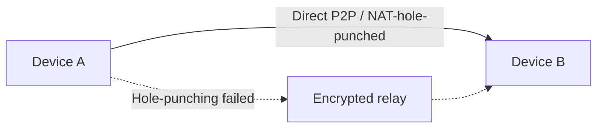

UniClipboard splits "how do two devices end up talking to each other?"
into three independent layers. Knowing where each one ends helps you
reason about failure modes and what's actually on the wire.

| Layer         | What it answers                          | Mechanism                                                |
| ------------- | ---------------------------------------- | -------------------------------------------------------- |
| **Trust**     | Should I accept payloads from this peer? | One-time invite code + space passphrase                  |
| **Discovery** | Where is this peer right now?            | iroh node IDs + LAN mDNS + rendezvous lookup             |
| **Transport** | How do bytes actually move?              | iroh QUIC: direct P2P first, encrypted relay as fallback |

The application-layer payload is encrypted **independently of the
transport** with XChaCha20-Poly1305. The transport could be malicious
and the relay could be hostile — they would still see only ciphertext.

## Trust: the space + invite model

Devices don't trust _each other_; they trust a **space**. A space is
the unit of identity, key material, and history. Joining a space is
the only way to start syncing.

### Creating a space (sponsor)

The first device runs `init` (CLI) or **Create a new space** (GUI).
That step:

1. Prompts for a passphrase.
2. Derives a key-encryption key (KEK) from the passphrase via
   **Argon2id** (128 MB memory, 3 iterations, 4 threads).
3. Generates a fresh **MasterKey** (the space's content key) and seals
   it under the KEK in a local KeySlot file.
4. Stores the KEK in the OS keychain (macOS Keychain, Windows
   Credential Manager, Linux Secret Service).

There is no "create account" call to any server. The space exists
entirely on the sponsor's machine until another device is invited.

### Joining a space (joiner)

`invite` (sponsor) prints a short-lived, one-time invitation code. The
joiner runs `join <code>` and supplies the same passphrase. Under the
hood:

1. The invite code carries the sponsor's iroh node ID and a transient
   handshake secret. It does **not** carry the passphrase.
2. The two devices run a **password-authenticated key exchange** —
   the joiner proves it knows the passphrase without sending it. A
   wrong passphrase fails the handshake; the sponsor never sees the
   guess.
3. On success, the sponsor wraps the MasterKey under a fresh KEK
   derived from the joiner's passphrase entry, and the joiner persists
   it the same way the sponsor did during `init`.
4. Both devices add each other to their **paired devices** list.

After this point, the invite code is consumed. Adding a third device
means generating a new invite — pairing is per-join, not per-pair.

<Callout type="info">
  Lost a device? Revoke it from any other device in the space (GUI: **Devices** page; CLI: pending).
  Subsequent traffic refuses transport from the revoked node ID.
</Callout>

## Discovery: finding the other end

Trust tells the daemon _which_ peers to talk to. Discovery tells it
_where_ to find them right now. UniClipboard is built on
[iroh](https://www.iroh.computer), so each device has a stable
**node ID** (an Ed25519 public key) that survives Wi-Fi changes,
sleep, and IP-address churn.

To translate a node ID into a current network address, the daemon
runs three lookups in parallel:

- **mDNS** for LAN discovery. Same broadcast domain → instant
  resolution. This is what keeps same-Wi-Fi syncs from paying any
  relay overhead.
- **Rendezvous lookup** over HTTPS for cross-network discovery.
  Peers publish signed address records that other peers can fetch by
  node ID.
- **Direct addresses** the peer learned about itself from previous
  sessions.

The first one to return a reachable candidate wins. mDNS keeps the
LAN case fast; rendezvous + direct candidates cover everything else.

## Transport: how bytes actually move

Once the daemon has a candidate address, iroh's transport stack
takes over.

- **Direct P2P first.** Same network, NAT'd home networks reachable
  via hole-punching, IPv6 — anywhere a direct path exists, iroh uses
  it.
- **Encrypted relay fallback.** If hole-punching fails (symmetric NAT,
  hostile firewalls, locked-down corporate networks), iroh falls back
  to an encrypted relay. The relay can route packets between peers
  but cannot decrypt them.
- **QUIC, not raw TCP.** Faster connection setup, multiplexed
  streams, and built-in resilience to network changes (Wi-Fi switches,
  laptop sleep, mobile-data handoff).

### What the relay sees vs. what your peers see

| Observer           | Sees                                             |
| ------------------ | ------------------------------------------------ |
| The relay          | Source / destination node IDs, encrypted packets |
| A network onlooker | QUIC traffic to your peer or to the relay        |
| The receiving peer | Decrypted clipboard payload — only paired peers  |

The application-layer encryption (XChaCha20-Poly1305 with a 24-byte
random nonce) is derived from the space MasterKey, not from the QUIC
session keys. Relay compromise does not weaken payload
confidentiality.

## Mobile companion (LAN-only)

Mobile devices use a **separate, simpler path** than desktop peers.
They don't join the iroh trust mesh, they don't get a node ID, and
they don't pair via the invite + passphrase + PAKE flow. Instead, the
desktop daemon advertises a SyncClipboard-compatible HTTP service on
your local network, and a paired mobile client talks to it with HTTP
Basic Auth credentials minted at registration.

| Aspect         | Desktop ↔ desktop                              | Desktop ↔ mobile                                     |
| -------------- | ---------------------------------------------- | ---------------------------------------------------- |
| Trust unit     | Space + passphrase (PAKE)                      | Per-device username + password (Basic Auth)          |
| Identity       | iroh node ID (Ed25519 keypair)                 | Registered device record on the desktop              |
| Discovery      | mDNS + rendezvous + cached direct addrs        | Manual base URL (LAN IP + port) shown at pairing     |
| Transport      | iroh QUIC, P2P first, encrypted relay fallback | Plain HTTP on the LAN — **no QUIC, no relay**        |
| Cross-network  | Yes (hole-punching, relay)                     | **No** — same LAN only                               |
| End-to-end key | XChaCha20-Poly1305 under the space MasterKey   | TLS-less HTTP; payload hashed and authenticated only |

### Pairing a mobile device

On the desktop, open **Devices → Add → Mobile sync** (the same panel
that hosts the per-device list). The pairing flow:

1. Pick a label for the device.
2. The daemon mints a one-time username and password and shows them
   inside a **credentials modal** with iOS / Android tabs:
   - **iOS** — scan the QR code to install the bundled UniClipboard
     iOS Shortcut, which is pre-filled with the base URL and
     credentials.
   - **Android / other clients** — copy the base URL, username, and
     password into any SyncClipboard-compatible client.
3. The plaintext password is shown **once**; close the modal and the
   desktop only retains an Argon2id hash. If the user loses it, use
   **Rotate password** on the device row to mint a new one.

Settings — LAN listener on/off, advertised IP and port — live behind
the **Mobile sync settings** sheet on the same page.

### What mobile sync does _not_ do

- **No iroh / no relay.** The mobile listener is a separate HTTP
  service. There's no NAT hole-punching, no encrypted-relay fallback,
  no QUIC. Off-LAN clients simply can't reach the desktop.
- **No mobile ↔ mobile sync.** Two phones don't talk to each other —
  they each talk to the desktop, and the desktop relays.
- **No per-direction / per-content-type gates yet.** The
  [per-peer toggles](./devices#content-type-allowlist) on the
  desktop-peer settings sheet apply only to desktop ↔ desktop
  pairings.
- **No participation in space history.** Mobile devices don't get a
  copy of the encrypted space database — they read and write through
  the SyncClipboard endpoints in real time.

See [Mobile LAN API](../reference/mobile-api) for the wire protocol.

## Recovery & reconnection

- **Wi-Fi switch / laptop wake / brief outage:** the daemon keeps
  retrying, and iroh re-establishes the QUIC session as soon as a
  candidate becomes reachable. No re-pairing, no user action.
- **IP rotation:** node IDs are stable, so the address can change and
  peers will still find each other through discovery on the next
  exchange.
- **Major-version upgrade across the 0.6 boundary:** the network
  stack was reworked, so old pairings from before 0.6 no longer
  resolve. Generate a new invite once and resume.

## Where to look next

- [Sync content](./sync) — the payload types that flow over this
  pipeline.
- [Quick start](../getting-started/quick-start) — the user-facing
  flow that exercises pairing end-to-end.
- [CLI reference](../reference/cli) — the headless equivalents of
  every step described here.
