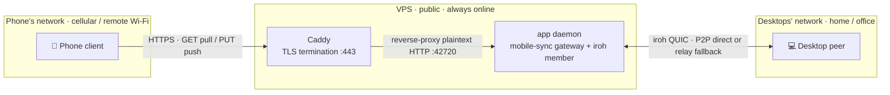

Since 0.13, UniClipboard can run on a server (VPS or container) as an
**always-online member** of your Space — a background service with **no
GUI and no system clipboard** (a "headless" node). It syncs clipboard
over iroh exactly like a desktop peer, and serves the mobile-sync gateway
to your phone behind TLS.

Use it when you want clipboard sync to keep working even when all your
desktops are asleep, and a stable HTTPS endpoint your phone can always reach.

This guide covers:

- What a server node is and isn't
- Deploying with Docker Compose (prebuilt image, or build from source)
- Provisioning: joining your Space and registering your phone
- TLS via the bundled Caddy, or behind a reverse proxy you already run
- Verifying, operating, and backing it up

## What it is and isn't

A server node is a **normal iroh member** that happens to be always
online and has no display:

- **Is**: an online peer that receives clipboard pushed by your desktops
  and persists it; a phone gateway that serves
  `GET /SyncClipboard.json` (pull) and `PUT` (push, fanned out back to
  your desktops over iroh).
- **Is not**: a relay, and **not** a central store-and-forward mailbox.
  It only keeps what it received **while it was online** — it is not an
  offline inbox. When a peer is offline, undelivered data stays on the
  sender, consistent with UniClipboard's P2P model.

If what you actually want is a transit point for NAT hole-punching
failures, that's a different thing — see
[Self-hosting an iroh relay](./self-host-relay).

The node never writes a system clipboard (there's no display on a VPS);
inbound items are persisted and fanned out, which is all a background
member needs to do.

## How cross-network sync flows

The phone never joins the iroh trust mesh — it takes a simpler HTTP path,
only ever talking to the server node's gateway. That always-online node
does the iroh P2P sync with your desktops on its behalf. So even with the
phone on cellular, your desktops at home, and the node in a datacenter,
all three on separate networks still reach each other.



- **Phone pulls**: `GET /SyncClipboard.json` over HTTPS to Caddy, proxied
  to the gateway, reading the latest clipboard the node has persisted.
- **Phone pushes**: `PUT` comes in the same way; the gateway accepts it and
  **fans it out** back to your desktops over iroh.
- **Desktop-pushed items**: sync to the node over iroh and get persisted, so
  the phone's next pull picks them up.

The node only persists what it received **while online** (see the previous
section) — it's a sync hub, not an offline inbox.

## Prerequisites

- A VPS with a public IPv4 address, **Docker + Docker Compose v2**.
- A **domain name** whose A/AAAA record points at the VPS — the phone
  reaches the node over HTTPS, and the bundled Caddy needs it to obtain
  a certificate. DNS must resolve **before** you start the stack.
- The following inbound ports open in the VPS firewall / security group:
  - **TCP/443** (and optionally **UDP/443** for HTTP/3) — the phone's
    HTTPS gateway.
  - **TCP/80** — the ACME HTTP-01 challenge Caddy uses to issue the cert.
  - A fixed **UDP** port for iroh direct connections (e.g. `42999/udp`) —
    so desktops on other networks can dial the node directly.
- An existing Space with **another device online** to pair with. The
  server node _joins_ a Space; it does not create one. Run `uniclip
invite` on a desktop already in the Space to get an invitation code.

## Get the stack

Everything lives in the repository under `deploy/vps/`:

```bash
git clone https://github.com/UniClipboard/UniClipboard.git
cd UniClipboard/deploy/vps
```

There are two ways to get the image. Pick one:

**Option A — pull the prebuilt image (recommended).** Every release
publishes a multi-arch (amd64 + arm64) image to the GitHub Container
Registry. No compiler, and you only need this `deploy/vps/` directory:

```bash
docker compose pull
```

Pin a release in `.env` with
`UC_IMAGE=ghcr.io/uniclipboard/uniclipboard-server:vX.Y.Z` (defaults to
`:latest`).

**Option B — build from source.** Needs the repo checked out **with
submodules** (the build uses the vendored `iroh-blobs` fork) and ~4 GB
of RAM:

```bash
git submodule update --init --recursive
docker compose build
```

<Callout type="info">
  A small VPS (≤ 2 GB RAM) cannot build from source — it will OOM. Use Option A, or build the image
  on a bigger machine of the same architecture and ship it with `docker save … | ssh vps 'docker
  load'`.
</Callout>

## Configure

Copy the env template and fill in your values:

```bash
cp .env.example .env
```

```bash
# .env
UC_DOMAIN=clip.example.com      # A/AAAA record → this VPS; Caddy gets a cert for it
UC_PUBLIC_IP=203.0.113.7        # this VPS's public IPv4, advertised to desktop peers
UC_IROH_BIND_PORT=42999         # fixed UDP port for iroh direct connections
```

Under the hood these map to the daemon's networking knobs documented in
[CLI — environment variables](../cli/environment): `UC_IROH_BIND_PORT`
pins the iroh UDP port and `UC_IROH_PUBLIC_ADDR`
(`${UC_PUBLIC_IP}:${UC_IROH_BIND_PORT}`) advertises this node's public
socket so peers can dial it directly.

## Provision (one-time, before the daemon)

`join` and the `mobile` write commands **refuse to run while a
daemon is up**, so all provisioning happens in one-off containers first.
They share the same state volume the long-running daemon will read.

**1. Join your Space.** On a desktop already in the Space, run `uniclip
invite` to get a code, then:

```bash
docker compose run --rm app uniclip join
```

This prompts interactively for the **invitation code** and the **Space
passphrase** (run it from an interactive terminal so the passphrase
never lands in your shell history).

**2. Enable the mobile-sync gateway for your domain.** `--url`
makes the phone's install URL/QR point at your HTTPS endpoint:

```bash
docker compose run --rm app \
  uniclip mobile network set \
  --url https://clip.example.com \
  --accept-network-risk
```

**3. Register your phone.** Mints credentials and renders the install QR:

```bash
docker compose run --rm app uniclip mobile add --label "My iPhone"
```

Copy the one-time password it prints — it is not shown again.

## Start the stack

```bash
docker compose up -d
```

This brings up two containers:

- **`app`** — the headless daemon (`uniclip start --server`). Joins the
  Space over iroh and serves the mobile-sync gateway. The iroh UDP port
  is published to the host; the plaintext gateway port is **only** on
  the internal Docker network.
- **`caddy`** — terminates TLS on `443`, obtains a certificate for
  `UC_DOMAIN` automatically, and reverse-proxies to the app's gateway.

The first start runs the ACME flow; tail `docker compose logs -f caddy`
to confirm the certificate was issued.

## Connect your phone

Scan the QR from step 3 (or open the printed `https://<domain>` install
URL) in the UniClipboard / SyncClipboard mobile client. The phone now
pulls the latest clipboard and pushes new content through Caddy; pushes
fan out to your desktops over iroh. See
[Mobile sync](../core-features/mobile-sync) for the client side.

## Behind a reverse proxy you already run

If the host already serves `80`/`443` (nginx, Caddy, Traefik, 1Panel's
OpenResty, …), **don't run the bundled Caddy** — it would conflict.
Instead, expose the gateway on loopback and let your existing proxy
front it.

Add an override next to the compose file:

```yaml
# docker-compose.override.yml
services:
  app:
    ports:
      - '127.0.0.1:42720:42720'
```

Start only the daemon (not Caddy):

```bash
docker compose up -d app
```

Then add a virtual host on your existing proxy for `clip.example.com`
that terminates TLS and reverse-proxies to `http://127.0.0.1:42720`,
forwarding the `Authorization` header. The gateway is plain HTTP +
Basic Auth, with no websockets, so a default reverse-proxy block is
enough.

<Callout type="warn">
  Never publish the plaintext gateway port (`42720`) to a public interface — it's HTTP + Basic Auth,
  designed to sit behind TLS. Keep it on loopback or the internal Docker network and only expose
  `443` through your proxy.
</Callout>

## State and backups

Everything needed to keep identity, Space membership, and mobile
credentials lives under `HOME=/data` on the `uniclip-state` volume, so
the node **never re-pairs** across restarts. Under
`/data/.local/share/app.uniclipboard.desktop/`:

| State                        | Path                                        |
| ---------------------------- | ------------------------------------------- |
| iroh identity (node secret)  | `iroh-identity/`                            |
| file-based KEK               | `keyring/`                                  |
| keyslot + device id          | `vault/keyslot.json`, `vault/device_id.txt` |
| database                     | `uniclipboard.db`                           |
| iroh blob cache              | `iroh-blobs/blobs.db`                       |
| settings (mobile creds, LAN) | `settings.json`                             |

On a server with no desktop environment there's no system keyring, so the
daemon falls back to file-based secure storage automatically — the iroh secret and KEK live
on the volume. Back it up (and Caddy's volume, which holds the issued
certificate):

```bash
docker run --rm -v uniclip-state:/data -v "$PWD":/backup alpine \
  tar czf /backup/uniclip-state.tgz -C /data .
```

## Operations

```bash
docker compose logs -f app                       # follow daemon logs
docker compose restart app                       # restart the daemon (state kept)
docker compose down                              # stop the stack (volumes kept)
docker compose pull && docker compose up -d      # update (Option A: prebuilt image)
docker compose up -d --build                     # update (Option B: build from source)
```

Updates keep the state volume, so a new image just swaps the binary — no
re-pairing. To change the advertised domain or add devices later, **stop
the daemon first** (`docker compose down`), rerun the relevant
`mobile` command, then `docker compose up -d` — the write commands
still refuse to run while the daemon is up.

## Verifying

```bash
docker compose ps                                # app should be "healthy"

# TLS + gateway reachable; 401 = listener up, auth required (expected without creds):
curl -i https://clip.example.com/SyncClipboard.json

# The plaintext gateway port is NOT exposed on the host (should refuse):
curl -i http://clip.example.com:42720/SyncClipboard.json
```

For an end-to-end check: copy something on a paired desktop on another
network and watch it land in `docker compose logs app`; then push from
the phone and confirm it appears on your desktops.

## Troubleshooting

| Symptom                               | Where to look                                                                                        |
| ------------------------------------- | ---------------------------------------------------------------------------------------------------- |
| `setup not complete` on `up -d`       | Provisioning (`join`) didn't persist. Confirm the `docker compose run` commands hit the same volume. |
| Caddy never gets a certificate        | DNS for `UC_DOMAIN` must resolve to this VPS and `80`/`443` must be open **before** `up -d`.         |
| Phone gets the wrong URL              | Re-run `mobile network set --url https://<domain>` (daemon stopped), then `up -d`.                   |
| Desktop on another network won't sync | Open `UC_IROH_BIND_PORT/udp` in the firewall and check `UC_PUBLIC_IP` is the real public IP.         |
| `401` through your reverse proxy      | That means the gateway is up and asking for Basic Auth — use the credentials from `add`.             |
