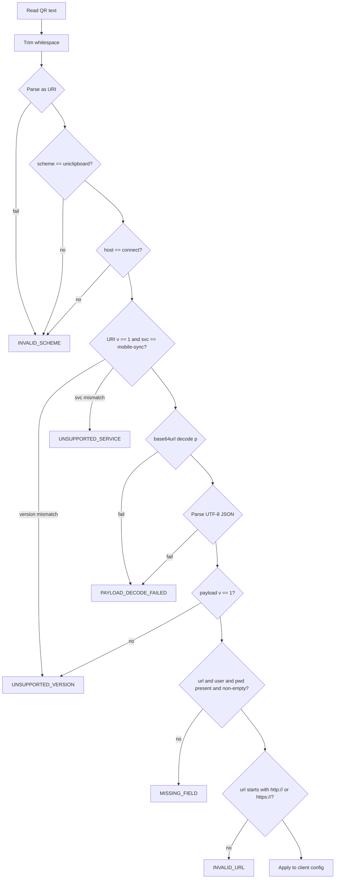
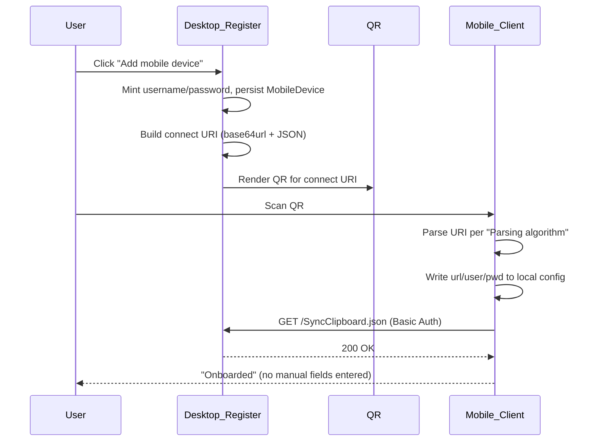

The `uniclipboard://connect` URI is a single-QR deep link that carries every
piece of information a mobile client needs to join the desktop's LAN mobile-sync
listener — base URL, username, plaintext one-time password, and extensible
metadata.

This page is the canonical specification of the protocol. Implement against it
when you are writing:

- A new SyncClipboard-compatible client (Android, desktop, web, etc.).
- An iOS shortcut, automation, or App that consumes the QR scanned from the
  UniClipboard desktop credentials modal.
- Any other tool that needs to parse the QR produced by the desktop **Add
  device → Scan to add** flow.

<Callout type="info">
  The URI only carries credentials and metadata. The HTTP wire protocol stays
  SyncClipboard-compatible (`GET /SyncClipboard.json` + HTTP Basic Auth). See [Mobile LAN
  API](./mobile-api) for the endpoints your client will call after parsing the URI.
</Callout>

## URI shape

```
uniclipboard://connect?v=1&svc=mobile-sync&p=<PAYLOAD>
```

| Component   | Value                                                                                         |
| ----------- | --------------------------------------------------------------------------------------------- |
| Scheme      | `uniclipboard` — the **only** accepted scheme                                                 |
| Host        | `connect`                                                                                     |
| Query `v`   | URI envelope version. v1 = `1`.                                                               |
| Query `svc` | Service identifier. v1 supports `mobile-sync` only.                                           |
| Query `p`   | **base64url (no padding)** of the UTF-8 JSON payload (see [Payload schema](#payload-schema)). |

**Why a single scheme?** A single canonical scheme keeps Intent filters / URL
handlers / parser logic simple, removes one source of cross-platform
inconsistency, and avoids accidentally splitting clients into "accepts both"
vs. "accepts only one" tiers. Decoders MUST reject any other scheme with
`INVALID_SCHEME`.

**Why base64url-encode the JSON payload?** The payload contains a plaintext
password and a URL with `:` and `/`. URL-encoding them inline
(`?url=...&user=...&pwd=...`) bloats the QR and creates an attack surface
around percent-decoding edge cases. base64url keeps the payload opaque to URL
parsers and minimizes QR size for typical credentials.

**Size budget**: typical payload JSON is 150–350 bytes → URI 200–470 chars →
QR Version ~15–18. Encoders MUST refuse to produce a URI longer than 800
characters; the only realistic way to exceed this is by abusing `o` with large
values, which is forbidden (see [Optional metadata](#optional-o-metadata)).

## Payload schema

After base64url-decoding `p`, the result is a UTF-8 JSON object:

```json
{
  "v": 1,
  "url": "http://192.168.1.5:42720",
  "user": "mobile_aabbccdd",
  "pwd": "AbCdEfGhIjKlMnOpQrSt",
  "o": {
    "label": "My iPhone",
    "did": "did_0123abcd",
    "proto": "syncclipboard"
  }
}
```

### Required fields

| Field  | Type    | Semantics                                                                                                          |
| ------ | ------- | ------------------------------------------------------------------------------------------------------------------ |
| `v`    | integer | Payload schema version. v1 = `1`. Distinct from URI `v` (see [Why two version numbers](#why-two-version-numbers)). |
| `url`  | string  | Server base URL, e.g. `http://192.168.1.5:42720`. **No trailing slash.** Scheme MUST be `http` or `https`.         |
| `user` | string  | HTTP Basic Auth username. ASCII letter first, then `[A-Za-z0-9_]`, length 6–32.                                    |
| `pwd`  | string  | HTTP Basic Auth **plaintext** password. One-time display only; server retains only the Argon2id hash.              |

Clients construct request URLs as `{url}/SyncClipboard.json` and authenticate
with `Authorization: Basic base64(user:pwd)`.

### Optional `o` metadata

`o` is an object of string→string entries. **Clients MUST silently ignore
unknown keys.** Encoders MUST NOT depend on any client recognizing a specific
`o` key in order to connect; all connectivity comes from `url` / `user` /
`pwd`.

| Key       | Example value     | Purpose                                                                  |
| --------- | ----------------- | ------------------------------------------------------------------------ |
| `label`   | `"My iPhone"`     | Human-readable device name for client-side UI display.                   |
| `did`     | `"did_0123abcd"`  | Server-assigned `device_id`, for diagnostics and log correlation.        |
| `proto`   | `"syncclipboard"` | Protocol family hint. Future values may include `"uniclipboard-native"`. |
| `install` | `"shortcut-ex"`   | iOS Shortcut template hint, paired with the iCloud install URL constant. |

Parsers should be lenient: read the keys above when present; ignore everything
else without failing.

### Character encoding

- JSON MUST be UTF-8, minified (no whitespace), no trailing newline.
- Encoders MUST emit fields in this order: `v`, `url`, `user`, `pwd`, `o`. This
  keeps golden-vector byte equality deterministic across language implementations.
  Decoders MUST NOT depend on order.
- Inside `o`, keys MUST be sorted lexicographically (ASCII order). Same reason:
  byte-stable golden vectors across languages.
- `pwd` MAY contain any printable Unicode that survives JSON escaping; in
  practice the desktop mint flow produces ASCII-only values.

### Why two version numbers

- URI-level `v` (`?v=1`) lets a client reject the URI **before** base64-decoding
  when the envelope itself is incompatible (e.g. a future v2 wraps `p`
  differently).
- Payload `v` (inside JSON) lets a client reject the **contents** when the
  envelope was understood but field semantics changed.

In v1 they are both `1`. They will diverge if and only if the envelope format
ever changes in a way that base64url+JSON cannot accommodate.

## Parsing algorithm

All clients MUST implement the following sequence. Producing an error at any
step terminates parsing.



### Pseudocode

```
raw = trim(qr_text)
uri = parse(raw)                              # may throw → INVALID_SCHEME
require uri.scheme == "uniclipboard"          # else INVALID_SCHEME
require uri.host == "connect"                 # else INVALID_SCHEME

v   = int(uri.query["v"])                     # missing/non-int → UNSUPPORTED_VERSION
svc = uri.query["svc"]
p   = uri.query["p"]
require v == 1                                # else UNSUPPORTED_VERSION
require svc == "mobile-sync"                  # else UNSUPPORTED_SERVICE
require p non-empty                           # else PAYLOAD_DECODE_FAILED

json_bytes = base64url_decode_no_pad(p)       # malformed → PAYLOAD_DECODE_FAILED
payload    = json_parse(json_bytes)           # malformed → PAYLOAD_DECODE_FAILED

require payload.v == 1                        # else UNSUPPORTED_VERSION
require payload.url, payload.user, payload.pwd are non-empty strings   # else MISSING_FIELD
require payload.url matches /^https?:\/\//    # else INVALID_URL

# Optional connectivity probe (recommended)
optional: HTTP GET {payload.url}/SyncClipboard.json
          with Authorization: Basic base64(payload.user + ":" + payload.pwd)

# Apply to local config
write_config(url = payload.url, user = payload.user, pwd = payload.pwd)
foreach (k, v) in (payload.o or {}):
  if k in known_keys: consume(k, v)
  else: ignore                                # forward-compat
```

### Error codes

| Code                    | Trigger                                              | UX hint                                |
| ----------------------- | ---------------------------------------------------- | -------------------------------------- |
| `INVALID_SCHEME`        | Scheme ≠ `uniclipboard` or host ≠ `connect`.         | "Not a UniClipboard QR."               |
| `UNSUPPORTED_VERSION`   | URI `v` ≠ 1 or payload `v` ≠ 1.                      | "Please update your app."              |
| `UNSUPPORTED_SERVICE`   | URI `svc` ≠ `mobile-sync`.                           | "Service not supported in this build." |
| `PAYLOAD_DECODE_FAILED` | `p` missing, base64url malformed, or JSON malformed. | "QR is corrupted — regenerate it."     |
| `MISSING_FIELD`         | `url` / `user` / `pwd` missing or empty.             | "QR is incomplete — regenerate it."    |
| `INVALID_URL`           | `url` doesn't start with `http://` or `https://`.    | "QR contains an invalid server URL."   |

## Security constraints

### Plaintext password in QR

The QR **contains the plaintext password** (single-use display). This is
acceptable because:

- Display happens on a trusted LAN device the user already controls.
- The credential modal warns the user ("save now — won't be shown again") and
  the password is never persisted on the desktop side beyond the modal
  lifecycle.
- The server stores only the Argon2id hash; once the user rotates or revokes,
  **the old QR is immediately invalid** at the HTTP layer (Basic Auth rejects
  on hash mismatch).

**Mandatory rules for any code path that handles the URI on the client side:**

- MUST NOT log the full URI, the decoded payload, or the password. Log only
  redacted views (e.g. `uniclipboard://connect?v=1&svc=mobile-sync&p=<…48 chars…>`).
- MUST NOT include the URI in analytics events, crash reports, or error
  attachments.
- MUST NOT persist the URI to disk after the credential modal closes — store
  only the parsed `url` / `user` / `pwd` triple inside the client's normal
  credential storage.

### What MUST NOT go into the QR

Out of scope for `pwd` and `o` (v1):

- Space encryption keys.
- Daemon bearer tokens.
- LAN sync passphrases (separate flow).
- Per-message HMAC secrets.

These are unrelated to the SyncClipboard credential bundle. Putting them here
would broaden the blast radius of QR capture beyond a single device's HTTP
Basic Auth identity.

### Rotation and revocation

- **Password rotation**: the old QR becomes invalid the moment the new hash
  lands in storage. No client-side acknowledgment needed.
- **Device revocation**: same; the row is deleted (or the hash cleared) and
  Basic Auth fails.

The user must regenerate the QR via **Add device** again. There is
intentionally no "refresh existing QR" affordance — that would imply
server-side QR storage, which the desktop avoids.

## Mapping to SyncClipboard configuration

| Protocol field | SyncClipboard / iOS Shortcut config slot          |
| -------------- | ------------------------------------------------- |
| `url`          | Server URL (`url` parameter in the Shortcut)      |
| `user`         | Username                                          |
| `pwd`          | Password                                          |
| `o.*`          | Local UI / diagnostics only; never sent over HTTP |

The HTTP wire protocol is unchanged — see [Mobile LAN API](./mobile-api).

## Golden test vector

This vector is the canonical interoperability anchor. Any conforming
implementation MUST be able to:

1. **Decode** the encoded URI below and recover exactly the payload JSON shown.
2. **Encode** the payload JSON and produce **byte-for-byte** the URI below
   (assuming the implementation enforces spec field order and lexicographic
   `o`-key order).

If your encoder emits a different string, the bug is in the encoder, not in
this vector.

### Happy-path vector

**Payload JSON (minified, fields in spec order):**

```
{"v":1,"url":"http://192.168.1.5:42720","user":"mobile_aabbccdd","pwd":"AbCdEfGhIjKlMnOpQrSt","o":{"did":"did_0123abcd","label":"Test","proto":"syncclipboard"}}
```

**Encoded URI:**

```
uniclipboard://connect?v=1&svc=mobile-sync&p=eyJ2IjoxLCJ1cmwiOiJodHRwOi8vMTkyLjE2OC4xLjU6NDI3MjAiLCJ1c2VyIjoibW9iaWxlX2FhYmJjY2RkIiwicHdkIjoiQWJDZEVmR2hJaktsTW5PcFFyU3QiLCJvIjp7ImRpZCI6ImRpZF8wMTIzYWJjZCIsImxhYmVsIjoiVGVzdCIsInByb3RvIjoic3luY2NsaXBib2FyZCJ9fQ
```

### Negative vectors

Each input below MUST produce the listed error code on parse:

| #   | Input                                                                                                                      | Expected error          |
| --- | -------------------------------------------------------------------------------------------------------------------------- | ----------------------- |
| 1   | `https://example.com/connect?v=1&svc=mobile-sync&p=eyJ2IjoxfQ`                                                             | `INVALID_SCHEME`        |
| 2   | `uniclipboard://connect?v=2&svc=mobile-sync&p=eyJ2IjoxfQ`                                                                  | `UNSUPPORTED_VERSION`   |
| 3   | `uniclipboard://connect?v=1&svc=other&p=eyJ2IjoxfQ`                                                                        | `UNSUPPORTED_SERVICE`   |
| 4   | `uniclipboard://connect?v=1&svc=mobile-sync&p=not-valid-base64!@#`                                                         | `PAYLOAD_DECODE_FAILED` |
| 5   | `uniclipboard://connect?v=1&svc=mobile-sync&p=eyJ2IjoxLCJ1cmwiOiJodHRwOi8vYS5iIiwidXNlciI6InUifQ` (no `pwd`)               | `MISSING_FIELD`         |
| 6   | `uniclipboard://connect?v=1&svc=mobile-sync&p=eyJ2IjoxLCJ1cmwiOiJmdHA6Ly9hLmIiLCJ1c2VyIjoidSIsInB3ZCI6InAifQ` (ftp scheme) | `INVALID_URL`           |

## End-to-end onboarding flow



## Implementing a new client

If you are building a third-party SyncClipboard-compatible client that wants
to join UniClipboard via QR, your work is:

1. **Register a URL handler** for the `uniclipboard` scheme on your platform
   (Android Intent filter, iOS URL types, custom-protocol handler on desktop,
   etc.). Optionally also accept the URI from an in-app QR scanner.
2. **Parse the URI** per [Parsing algorithm](#parsing-algorithm). Surface the
   error codes to the user with the suggested UX hints.
3. **Store** the parsed `url` / `user` / `pwd` triple in your normal server
   configuration. Treat the password as a regular HTTP Basic Auth secret from
   that point on.
4. **Optionally probe** `GET {url}/SyncClipboard.json` with the credentials
   before declaring success — this catches "old QR after password rotation"
   and stale LAN IPs early.
5. **Speak the HTTP API** documented in [Mobile LAN API](./mobile-api). The
   wire protocol is unchanged from v1 SyncClipboard semantics.

No coordination with the UniClipboard team is required — the spec on this
page is the contract.

## Forward compatibility

The following are **not** part of v1 but the protocol is shaped to accommodate
them. Implement strictly to v1 today; future revisions will document the
additions.

- **`o.exp` (expiry)** — Unix-ms timestamp after which a parser should refuse
  the URI. Lets the desktop emit time-bounded onboarding QRs. v1 parsers
  ignore (the "ignore unknown" rule covers it); v2 parsers will enforce. No
  payload-version bump needed because it's an additive `o` key.
- **`o.token` (one-time exchange)** — a short-lived bearer for a future
  HTTPS exchange endpoint that returns the actual credentials. Lets the QR
  carry no plaintext password. Would bump payload `v` to 2 because the
  semantics of `pwd` change (no longer carried inline).
- **Per-device push channel hints** — `o.push` for APNs/FCM topic. Additive,
  no version bump.

Any change that _removes_ or _re-types_ a required v1 field requires bumping
payload `v`.
