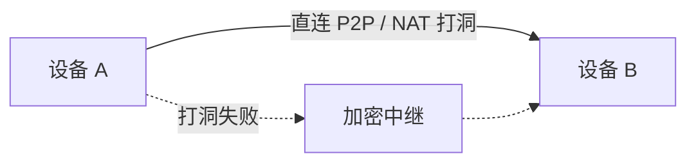

UniClipboard 把"两台设备如何最终建立通信"拆成三层独立的问题。理解每一层的边界，
有助于判断故障位置以及"线上实际跑着什么"。

| 层次     | 回答的问题           | 实现机制                                     |
| -------- | -------------------- | -------------------------------------------- |
| **信任** | 我应该接受谁的负载？ | 一次性邀请码 + 空间口令                      |
| **发现** | 这个对端现在在哪里？ | iroh node ID + 局域网 mDNS + rendezvous 查询 |
| **传输** | 字节实际怎么走？     | iroh QUIC：优先 P2P 直连，失败回落加密中继   |

应用层负载使用 XChaCha20-Poly1305 加密，**独立于传输层**。即便传输层有人窃听、中继被恶意接管，
它们看到的也只是密文。

## 信任：空间 + 邀请码模型

设备之间并不直接相互信任，它们都信任一个 **空间（Space）**。空间是身份、密钥与历史记录的最小单位，
加入空间是开始同步的唯一前置条件。

### 创建空间（sponsor）

第一台设备执行 `init`（CLI）或选择 **新建空间**（GUI）。这一步会：

1. 提示输入口令。
2. 通过 **Argon2id** 从口令派生密钥加密密钥（KEK）—— 内存 128 MB、迭代 3 次、并行度 4。
3. 生成全新的 **MasterKey**（空间的内容密钥），用 KEK 封装后写入本地 KeySlot 文件。
4. 把 KEK 存入系统密钥环（macOS Keychain、Windows Credential Manager、Linux Secret Service）。

整个过程没有任何"创建账号"的远程调用。在邀请其他设备之前，空间完全只存在于 sponsor 本机。

### 加入空间（joiner）

sponsor 执行 `invite` 后会得到一段短期、一次性的邀请码。joiner 在 `join <code>` 时输入相同的口令。
内部流程：

1. 邀请码携带 sponsor 的 iroh node ID 与一个临时握手秘密，**不** 携带口令本身。
2. 双方执行 **口令认证密钥交换（PAKE）**—— joiner 在不发送口令的前提下证明自己持有口令。
   口令错误会让握手失败，sponsor 也永远看不到错误的口令值。
3. 握手成功后，sponsor 用 joiner 输入口令派生出的新 KEK 重新封装 MasterKey，joiner 像
   `init` 那样把它持久化。
4. 双方互相加入对方的 **已配对设备** 列表。

这一刻邀请码即作废。要加入第三台设备就要再生成新邀请码 —— 配对是按"加入"计数，不是按"对"计数。

<Callout type="info">
  设备丢了？在空间内的任意其他设备上吊销它（GUI 在 **设备** 页）。后续流量会拒绝来自被吊销 node ID
  的传输请求。
</Callout>

## 发现：找到对端的位置

信任层告诉守护进程 **和谁** 通信，发现层负责找出 **对方现在在哪里**。UniClipboard 基于
[iroh](https://www.iroh.computer)，每台设备都有一个稳定的 **node ID**（一个 Ed25519 公钥），
切 Wi-Fi、唤醒睡眠、IP 变化都不影响它。

把 node ID 解析成可用网络地址时，守护进程会并行跑三种查找：

- **mDNS** 局域网发现。同一广播域 → 即时解析。这是同 Wi-Fi 同步不必经过中继的关键。
- **Rendezvous 查询**（基于 HTTPS）跨网络发现。对端会发布签好名的地址记录，其他设备可以通过 node ID 拉取。
- **直连地址缓存** —— 上次会话学到的对端可达地址。

谁先返回可达候选谁就胜出。mDNS 让局域网保持低延迟，rendezvous + 直连地址覆盖其他场景。

## 传输：字节实际怎么走

一旦守护进程拿到候选地址，iroh 的传输栈接管。

- **优先 P2P 直连。** 同网络、可以打洞穿透的家庭 NAT、IPv6 —— 只要存在直连路径，iroh 都会用上。
- **加密中继回落。** 打洞失败（对称 NAT、敌意防火墙、严格的企业网络）时，iroh 走加密中继。
  中继可以在两端之间路由数据包，但无法解密。
- **QUIC，而不是裸 TCP。** 连接建立更快、流多路复用、对网络切换天然鲁棒（切 Wi-Fi、笔记本休眠、
  移动数据网络切换）。

### 中继看到的 vs. 对端看到的

| 观察者     | 能看到什么                         |
| ---------- | ---------------------------------- |
| 中继       | 源 / 目的 node ID 与加密后的数据包 |
| 网络旁观者 | 流向对端或中继的 QUIC 流量         |
| 接收对端   | 解密后的剪贴负载 —— 仅限已配对设备 |

应用层加密（XChaCha20-Poly1305，24 字节随机 nonce）由空间 MasterKey 派生，与 QUIC 会话密钥无关。
中继被攻陷不会削弱负载机密性。

## 移动端伴侣（仅限 LAN）

移动设备使用一条 **独立、更简的路径**，与桌面对端不一样。它们不加入 iroh
信任网络、不分配 node ID、也不走 邀请码 + 口令 + PAKE 流程。桌面守护进程在
局域网上发布一个 SyncClipboard 兼容的 HTTP 服务，已注册的移动客户端通过在
配对时签发的 HTTP Basic Auth 凭据与之通信。

| 维度       | 桌面 ↔ 桌面                               | 桌面 ↔ 移动端                                  |
| ---------- | ----------------------------------------- | ---------------------------------------------- |
| 信任单位   | 空间 + 口令（PAKE）                       | 每设备一组用户名 + 密码（Basic Auth）          |
| 身份       | iroh node ID（Ed25519 公私钥）            | 桌面端持久化的注册设备记录                     |
| 发现       | mDNS + rendezvous + 直连地址缓存          | 手动填入 base URL（LAN IP + 端口），配对时显示 |
| 传输       | iroh QUIC，先 P2P 直连，失败回落加密中继  | 局域网上的明文 HTTP —— **无 QUIC、无中继**     |
| 跨网络     | 支持（打洞 / 中继）                       | **不支持**，仅同一局域网                       |
| 端到端密钥 | XChaCha20-Poly1305，由空间 MasterKey 派生 | 没有 TLS；负载只做哈希与鉴权                   |

### 配对移动设备

在桌面端打开 **设备 → 添加 → 移动设备同步**（与对端列表同一面板）。配对流程：

1. 给这台设备起一个标签。
2. 守护进程签发一组一次性用户名 + 密码，在 **凭据弹窗** 里展示，含 iOS / Android tab：
   - **iOS** —— 扫描二维码可一键安装内置的 UniClipboard iOS 快捷指令，
     其中预填了 base URL 与凭据。
   - **Android / 其他客户端** —— 复制 base URL、用户名、密码到任意兼容
     SyncClipboard 协议的客户端即可。安卓侧目前推荐社区维护的 Flutter
     客户端 [sync-clipboard-flutter](https://github.com/bling-yshs/sync-clipboard-flutter)（APK 直装、无须 Google Play）。
3. 明文密码 **只显示一次**；弹窗关闭后桌面只保留 Argon2id 哈希。若用户遗失，
   可在设备行使用 **轮换密码** 重新签发。

LAN 监听开关、对外宣告的 IP 与端口等设置位于同一面板的 **移动端同步设置** 抽屉。

### 移动端同步 **不** 做这些事

- **不走 iroh、不走中继。** 移动端监听器是独立的 HTTP 服务，没有 NAT 打洞、
  没有加密中继回落、没有 QUIC。离开 LAN 的客户端根本无法触达桌面。
- **移动端不会两两互联。** 两部手机不会直接通信，它们各自与桌面通信，由桌面转发。
- **暂无按方向 / 按内容类型的开关。** 设备页对端设置抽屉的
  [按对端的内容类型白名单](./devices#内容类型白名单)目前只对桌面 ↔ 桌面生效。
- **不参与空间历史。** 移动端不会获得空间加密数据库的副本，它们通过 SyncClipboard
  接口实时读写。

协议详情见 [移动端 LAN API](../reference/mobile-api)。

## 恢复与重连

- **切 Wi-Fi / 笔记本唤醒 / 短暂断网：** 守护进程会持续重试，iroh 在新候选地址可达时会重新建立 QUIC
  会话。无需重新配对，无需用户介入。
- **IP 变化：** node ID 是稳定的，地址变了下次发现时仍然能找到对端。
- **跨 0.6 大版本升级：** 网络栈在 0.6 做了重写，旧的配对状态不再有效。重新生成一次邀请码即可恢复。

## 接下来

- [同步内容](./sync) —— 流经这条管线的负载类型。
- [快速开始](../getting-started/quick-start) —— 端到端体验配对全流程的用户视角。
- [CLI 参考](../reference/cli) —— 用命令行做以上每一步。
