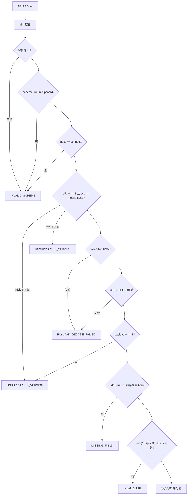
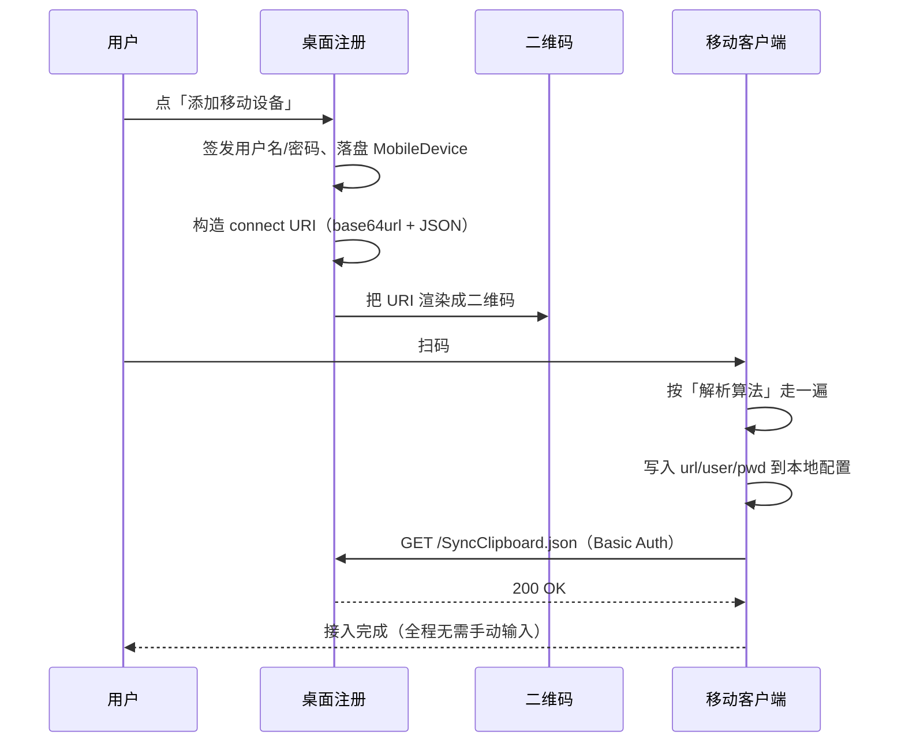

`uniclipboard://connect` URI 是一个单二维码深链，承载移动端客户端接入桌面 LAN
移动同步监听器所需的全部信息 —— base URL、用户名、一次性明文密码与可扩展元数据。

本页是该协议的规范单一真相。下列实现者应直接按本页对接：

- 新写一个兼容 SyncClipboard 协议的客户端（Android、桌面、Web 等）。
- 写一个 iOS 快捷指令 / 自动化 / 原生 App，消费从 UniClipboard 桌面凭据弹窗扫
  到的二维码。
- 任何需要解析桌面 **添加设备 → 扫码接入** 流程生成的二维码的工具。

<Callout type="info">
  本 URI 只承载凭据与元数据。HTTP wire 协议仍是兼容 SyncClipboard 的 （`GET /SyncClipboard.json` +
  HTTP Basic Auth）。解析完 URI 后客户端要调的 HTTP 端点见 [移动端 LAN API](./mobile-api)。
</Callout>

## URI 形态

```
uniclipboard://connect?v=1&svc=mobile-sync&p=<PAYLOAD>
```

| 字段        | 取值                                                                                       |
| ----------- | ------------------------------------------------------------------------------------------ |
| Scheme      | `uniclipboard` —— **唯一** 接受的 scheme                                                   |
| Host        | `connect`                                                                                  |
| Query `v`   | URI 信封版本，v1 = `1`                                                                     |
| Query `svc` | 服务标识，v1 仅支持 `mobile-sync`                                                          |
| Query `p`   | UTF-8 JSON payload 的 **base64url（无 padding）** 编码（见 [Payload 结构](#payload-结构)） |

**为什么只允许一个 scheme？** 单一 canonical scheme 让 Intent filter / URL
handler / 解析逻辑保持简单，消除一种跨平台不一致来源，避免把客户端意外切
成「两种都接受」/「只接受一种」两档。解析器 **必须** 用 `INVALID_SCHEME`
拒绝任何其它 scheme。

**为什么把 JSON payload 做 base64url？** Payload 里有明文密码和带 `:` `/`
的 URL。把它们直接 URL-encode 进 query
（`?url=...&user=...&pwd=...`）会让二维码膨胀，并在 percent-decoding 的边
界条件上引入攻击面。base64url 让 payload 对 URL 解析器保持不透明，并把典型
凭据的二维码尺寸压到最小。

**尺寸预算**：典型 payload JSON 150–350 字节 → URI 200–470 字符 → QR Version
约 15–18。编码器 **必须** 拒绝产生超过 800 字符的 URI；唯一会触碰这个上限的
场景是滥用 `o` 写大值，而这是不被允许的（见 [可选元数据](#可选-o-元数据)）。

## Payload 结构

`p` 经 base64url 解码后得到 UTF-8 JSON 对象：

```json
{
  "v": 1,
  "url": "http://192.168.1.5:42720",
  "user": "mobile_aabbccdd",
  "pwd": "AbCdEfGhIjKlMnOpQrSt",
  "o": {
    "label": "My iPhone",
    "did": "did_0123abcd",
    "proto": "syncclipboard"
  }
}
```

### 必填字段

| 字段   | 类型   | 语义                                                                                                     |
| ------ | ------ | -------------------------------------------------------------------------------------------------------- |
| `v`    | 整数   | Payload 版本，v1 = `1`。与 URI `v` 区分（见 [为什么有两个版本号](#为什么有两个版本号)）。                |
| `url`  | 字符串 | 服务端 base URL，例如 `http://192.168.1.5:42720`。**不带尾斜杠**。scheme **必须** 为 `http` 或 `https`。 |
| `user` | 字符串 | HTTP Basic Auth 用户名。首字符 ASCII 字母，余下 `[A-Za-z0-9_]`，长度 6–32。                              |
| `pwd`  | 字符串 | HTTP Basic Auth **明文** 密码。仅一次性展示；服务端只保留 Argon2id 哈希。                                |

客户端用 `{url}/SyncClipboard.json` 拼请求 URL，认证头为
`Authorization: Basic base64(user:pwd)`。

### 可选 `o` 元数据

`o` 是一个 string→string 的对象。**客户端必须静默忽略未知键**。编码器
**不得** 依赖某个 `o` 键被客户端识别才能连通；所有连通性都来自
`url` / `user` / `pwd`。

| 键        | 示例值            | 用途                                                    |
| --------- | ----------------- | ------------------------------------------------------- |
| `label`   | `"My iPhone"`     | 客户端 UI 显示用的设备名。                              |
| `did`     | `"did_0123abcd"`  | 服务端分配的 `device_id`，用于诊断与日志关联。          |
| `proto`   | `"syncclipboard"` | 协议族提示。未来可能扩展为 `"uniclipboard-native"` 等。 |
| `install` | `"shortcut-ex"`   | iOS 快捷指令模板提示，与 iCloud 安装链接常量配对。      |

解析器应宽松：识别上面的键，其它键不识别但 **不要报错**。

### 字符编码

- JSON **必须** UTF-8 编码、minified（无空白）、无尾换行。
- 编码器 **必须** 按以下顺序输出字段：`v`、`url`、`user`、`pwd`、`o`。这样
  跨语言实现的 golden vector 才能保持字节一致。解码器 **不得** 依赖字段顺序。
- `o` 内的键 **必须** 按 ASCII 字典序排序，理由同上。
- `pwd` **可以** 包含任意能存进 JSON 转义的可打印 Unicode 字符；实际桌面端
  签发流程目前只产生 ASCII。

### 为什么有两个版本号

- URI 层的 `v`（`?v=1`）让客户端 **在 base64 解码之前** 就能拒绝不兼容的信
  封（例如未来 v2 改变了 `p` 的封装方式）。
- Payload 层的 `v`（JSON 内）让客户端在信封被理解之后，仍能在 **字段语义** 改
  变时拒绝。

v1 两者都是 `1`。只有 base64url+JSON 容纳不下的信封格式变更才会让它们分裂。

## 解析算法

所有客户端 **必须** 实现下列流程。任何一步出错都终止解析。



### 伪代码

```
raw = trim(qr_text)
uri = parse(raw)                              # 抛错 → INVALID_SCHEME
require uri.scheme == "uniclipboard"          # 否则 INVALID_SCHEME
require uri.host == "connect"                 # 否则 INVALID_SCHEME

v   = int(uri.query["v"])                     # 缺失/非整数 → UNSUPPORTED_VERSION
svc = uri.query["svc"]
p   = uri.query["p"]
require v == 1                                # 否则 UNSUPPORTED_VERSION
require svc == "mobile-sync"                  # 否则 UNSUPPORTED_SERVICE
require p 非空                                # 否则 PAYLOAD_DECODE_FAILED

json_bytes = base64url_decode_no_pad(p)       # 格式错 → PAYLOAD_DECODE_FAILED
payload    = json_parse(json_bytes)           # 格式错 → PAYLOAD_DECODE_FAILED

require payload.v == 1                        # 否则 UNSUPPORTED_VERSION
require payload.url, payload.user, payload.pwd 都是非空字符串   # 否则 MISSING_FIELD
require payload.url 匹配 /^https?:\/\//       # 否则 INVALID_URL

# 可选连通探测（推荐）
optional: HTTP GET {payload.url}/SyncClipboard.json
          带 Authorization: Basic base64(payload.user + ":" + payload.pwd)

# 写入本地配置
write_config(url = payload.url, user = payload.user, pwd = payload.pwd)
foreach (k, v) in (payload.o or {}):
  if k 在已知键集合: consume(k, v)
  else: ignore                                # 前向兼容
```

### 错误码

| 代码                    | 触发条件                                      | UX 提示                            |
| ----------------------- | --------------------------------------------- | ---------------------------------- |
| `INVALID_SCHEME`        | Scheme ≠ `uniclipboard` 或 host ≠ `connect`。 | 「不是 UniClipboard 的二维码。」   |
| `UNSUPPORTED_VERSION`   | URI `v` ≠ 1 或 payload `v` ≠ 1。              | 「请升级 App。」                   |
| `UNSUPPORTED_SERVICE`   | URI `svc` ≠ `mobile-sync`。                   | 「当前版本不支持该服务。」         |
| `PAYLOAD_DECODE_FAILED` | `p` 缺失、base64url 损坏或 JSON 损坏。        | 「二维码已损坏，请重新生成。」     |
| `MISSING_FIELD`         | `url` / `user` / `pwd` 缺失或为空。           | 「二维码内容不完整，请重新生成。」 |
| `INVALID_URL`           | `url` 不以 `http://` 或 `https://` 开头。     | 「二维码里的服务地址无效。」       |

## 安全约束

### QR 中含明文密码

二维码 **承载明文密码**（一次性展示）。这是可以接受的，因为：

- 展示发生在用户已经掌控的可信 LAN 设备上。
- 凭据弹窗会提醒用户「现在保存 —— 关闭后无法重新获取」，桌面端在弹窗生命周
  期之外不会再保留密码。
- 服务端只存 Argon2id 哈希；用户一旦轮换或吊销，**旧二维码立即失效**（HTTP
  层 Basic Auth 因哈希不匹配而拒绝）。

**任何在客户端处理本 URI 的代码路径必须遵守：**

- **不得** 把完整 URI、解码后的 payload 或密码写入日志。日志只允许 redacted
  视图（例如 `uniclipboard://connect?v=1&svc=mobile-sync&p=<…48 字符…>`）。
- **不得** 把 URI 写进 analytics 事件、crash 报告或错误附件。
- **不得** 在凭据弹窗关闭后把 URI 落盘 —— 只把解析出的
  `url` / `user` / `pwd` 三元组存入客户端的常规凭据存储。

### 什么 **不能** 放进二维码

v1 中 `pwd` 与 `o` 都不允许携带：

- 空间加密密钥
- Daemon bearer token
- LAN 同步 passphrase（另一条独立流程）
- 单消息 HMAC 秘钥

这些与 SyncClipboard 凭据 bundle 无关。放进来会把「二维码被截获」的爆炸半径
扩大到超出单台设备的 HTTP Basic Auth 身份。

### 轮换与吊销

- **密码轮换**：新哈希写入存储的那一刻旧二维码就失效，无需客户端回执。
- **设备吊销**：同上，行被删（或哈希被清空），Basic Auth 直接失败。

用户必须再次走 **添加设备** 流程重新生成二维码。**不存在** 「刷新已有
二维码」的入口 —— 那会暗示服务端要存储二维码内容，桌面端有意回避这件事。

## 与 SyncClipboard 配置项的映射

| 协议字段 | SyncClipboard / iOS 快捷指令配置项         |
| -------- | ------------------------------------------ |
| `url`    | Server URL（快捷指令里的 `url` 参数）      |
| `user`   | Username                                   |
| `pwd`    | Password                                   |
| `o.*`    | 仅用于客户端 UI / 诊断，绝不参与 HTTP 请求 |

HTTP wire 协议不变 —— 见 [移动端 LAN API](./mobile-api)。

## Golden 测试向量

下列向量是跨语言互操作的 canonical anchor。任何合规的实现 **必须** 能做到：

1. **解码** 下面的 URI，还原出与示例 JSON 完全一致的 payload。
2. **编码** 示例 payload JSON 时，产生与下面 URI **逐字节** 一致的字符串
   （前提是实现严格遵守规范字段顺序与 `o` 键字典序）。

如果你的编码器输出不一致，那是编码器的 bug，不是向量的 bug。

### 正向向量

**Payload JSON（minified，按规范字段顺序）：**

```
{"v":1,"url":"http://192.168.1.5:42720","user":"mobile_aabbccdd","pwd":"AbCdEfGhIjKlMnOpQrSt","o":{"did":"did_0123abcd","label":"Test","proto":"syncclipboard"}}
```

**编码后的 URI：**

```
uniclipboard://connect?v=1&svc=mobile-sync&p=eyJ2IjoxLCJ1cmwiOiJodHRwOi8vMTkyLjE2OC4xLjU6NDI3MjAiLCJ1c2VyIjoibW9iaWxlX2FhYmJjY2RkIiwicHdkIjoiQWJDZEVmR2hJaktsTW5PcFFyU3QiLCJvIjp7ImRpZCI6ImRpZF8wMTIzYWJjZCIsImxhYmVsIjoiVGVzdCIsInByb3RvIjoic3luY2NsaXBib2FyZCJ9fQ
```

### 反向向量

下列每条输入解析时 **必须** 产生对应的错误码：

| #   | 输入                                                                                                                       | 期望错误                |
| --- | -------------------------------------------------------------------------------------------------------------------------- | ----------------------- |
| 1   | `https://example.com/connect?v=1&svc=mobile-sync&p=eyJ2IjoxfQ`                                                             | `INVALID_SCHEME`        |
| 2   | `uniclipboard://connect?v=2&svc=mobile-sync&p=eyJ2IjoxfQ`                                                                  | `UNSUPPORTED_VERSION`   |
| 3   | `uniclipboard://connect?v=1&svc=other&p=eyJ2IjoxfQ`                                                                        | `UNSUPPORTED_SERVICE`   |
| 4   | `uniclipboard://connect?v=1&svc=mobile-sync&p=not-valid-base64!@#`                                                         | `PAYLOAD_DECODE_FAILED` |
| 5   | `uniclipboard://connect?v=1&svc=mobile-sync&p=eyJ2IjoxLCJ1cmwiOiJodHRwOi8vYS5iIiwidXNlciI6InUifQ` (缺 `pwd`)               | `MISSING_FIELD`         |
| 6   | `uniclipboard://connect?v=1&svc=mobile-sync&p=eyJ2IjoxLCJ1cmwiOiJmdHA6Ly9hLmIiLCJ1c2VyIjoidSIsInB3ZCI6InAifQ` (ftp scheme) | `INVALID_URL`           |

## 端到端接入流程



## 写一个新客户端

如果你在写一个想通过扫码接入 UniClipboard 的兼容 SyncClipboard 客户端，工
作量大致是：

1. **注册 URL handler**：在你平台上为 `uniclipboard` scheme 注册（Android
   Intent filter、iOS URL types、桌面自定义协议 handler 等）。也可以选择走
   App 内置的二维码扫描器接入。
2. **解析 URI**：按 [解析算法](#解析算法) 执行。把错误码按对应 UX 提示透出
   给用户。
3. **存储**：把解析出的 `url` / `user` / `pwd` 三元组存进你客户端原本的服
   务端凭据存储；后续把密码当成普通的 HTTP Basic Auth 秘钥用。
4. **可选探测**：保存前用 `GET {url}/SyncClipboard.json` + 凭据探一下连通
   性 —— 提早发现「密码轮换后旧二维码」「LAN IP 变了」之类的问题。
5. **走 HTTP API**：照 [移动端 LAN API](./mobile-api) 实现 wire 协议。它与
   v1 SyncClipboard 语义保持一致。

无需和 UniClipboard 团队对齐 —— 本页规范就是契约。

## 前向兼容

下列项 **不是** v1 的一部分，但协议形态已经预留了空间。今天严格按 v1 实现；
未来扩展时会在本规范里追加说明。

- **`o.exp`（过期时间）** —— Unix-ms 时间戳，解析器在此之后应拒绝该 URI。
  让桌面端可以签发限时二维码。v1 客户端按「忽略未知键」规则透明跳过；v2 客
  户端会强制校验。属于增量 `o` 键，无需 bump payload 版本号。
- **`o.token`（一次性兑换）** —— 短时 bearer，指向未来的 HTTPS 兑换端点，
  返回真正的凭据。让二维码不再携带明文密码。会把 payload `v` bump 到 2，
  因为 `pwd` 的语义变了（不再 inline 携带）。
- **每设备推送通道提示** —— `o.push` 携带 APNs/FCM topic 等。纯增量，无需
  版本号 bump。

任何 **移除** 或 **改变类型** 的 v1 必填字段变更都要 bump payload `v`。
