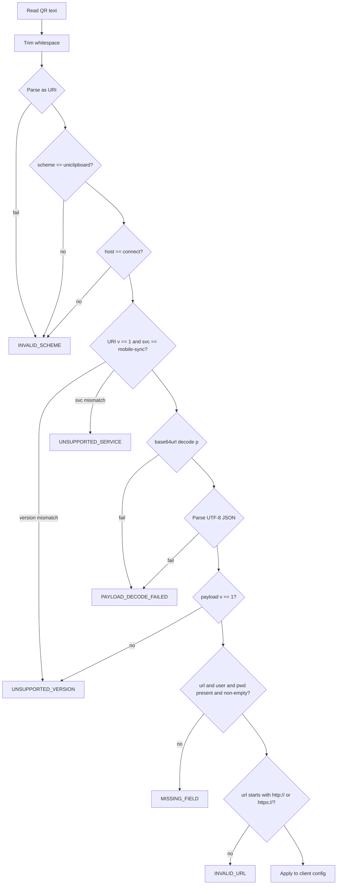
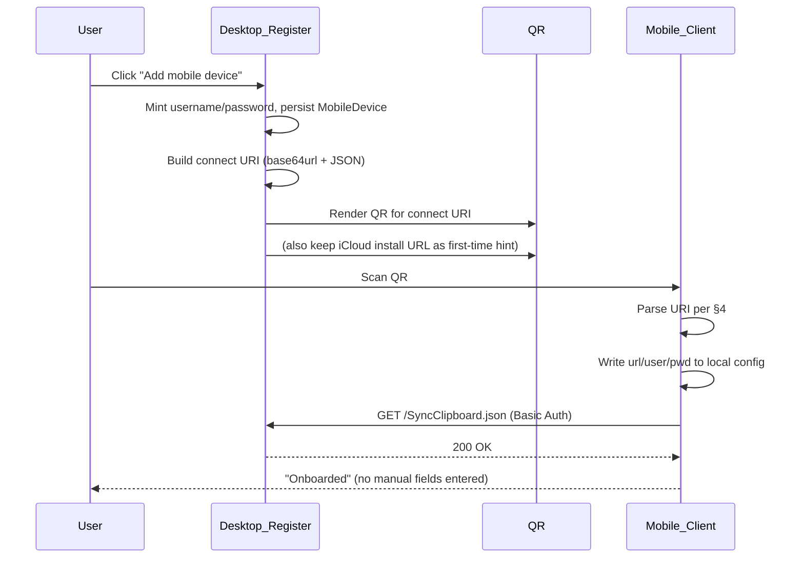

# Mobile Sync Connect URI — Protocol Specification

> Single source of truth for the `uniclipboard://connect` deep-link protocol used to onboard
> mobile clients (iOS Shortcut, Android SyncClipboard-compatible clients, future native apps)
> by encoding `base_url`, `username`, `password`, and extensible metadata into a single QR code.
>
> **Status**: v1 — accepted. Implemented across `uc-application`, Tauri DTOs, web UI, and
> client integration templates.
> **Revision 2026-06-11**: additive `urls` multi-candidate field (§3.1a, §7.3) — no
> version bump; see `docs/planning/mobile-sync-qr-multi-url.md` for the design rationale.
>
> **Tracking issue**: [#789](https://github.com/UniClipboard/UniClipboard/issues/789)

---

## 1. Why this protocol exists

`RegisterMobileShortcutDeviceUseCase` (`src-tauri/crates/uc-application/src/usecases/mobile_sync/register_device.rs`)
historically encoded **only** the static SyncClipboard "Clipboard EX" iCloud install URL
(`SYNC_CLIPBOARD_EX_INSTALL_URL`) into the device-registration QR. Mobile users still had
to **manually copy** three fields — server URL, username, password — from
`MobileSyncCredentialModal.tsx` into the SyncClipboard Shortcut configuration. The product
description ("scan to onboard") never matched the implementation.

This protocol replaces that gap with a single QR payload that carries everything a client
needs for unattended onboarding, while leaving the iCloud install URL as a one-time
bootstrap step ("first install of the Shortcut template").

Design constraints driving the shape below:

- **Single QR**: one scan, no manual fields. QR Version ≤ 20 (≤ ~800 chars URI) so it stays
  easy to scan on common phones in normal lighting.
- **Versioned**: future fields can be added without breaking v1 clients.
- **Multi-client neutral**: same payload works for iOS Shortcut, Android compatible clients,
  and any future native UniClipboard app.
- **Forward-compatible metadata**: `o` (other) is an open key-value bag; **clients ignore
  unknown keys** so the server can ship new hints without coordinated client releases.
- **Connectivity unchanged**: HTTP wire protocol stays SyncClipboard-compatible
  (`GET /SyncClipboard.json` + HTTP Basic Auth); the URI only carries credentials and
  metadata, never wire-level behavior.

---

## 2. URI shape

```
uniclipboard://connect?v=1&svc=mobile-sync&p=<PAYLOAD>
```

| Component   | Value                                                          |
| ----------- | -------------------------------------------------------------- |
| Scheme      | `uniclipboard` — the **only** accepted scheme                  |
| Host        | `connect`                                                      |
| Query `v`   | URI envelope version. v1 = `1`.                                |
| Query `svc` | Service identifier. v1 supports `mobile-sync` only.            |
| Query `p`   | **base64url (no padding)** of the UTF-8 JSON payload (see §3). |

**Why a single scheme?** Earlier internal docs and comments speculated about a `uniclip://`
short alias. v1 deliberately rejects that idea: a single canonical scheme keeps Intent
filters / URL handlers / parser logic simple, removes one source of cross-platform
inconsistency, and avoids accidentally splitting clients into "accepts both" vs.
"accepts only one" tiers. Decoders MUST reject any other scheme with `INVALID_SCHEME`.

**Why base64url-encode the JSON payload?** The payload contains a plaintext password and a
URL with `:` and `/`. URL-encoding them inline (`?url=...&user=...&pwd=...`) bloats the
QR and creates an attack surface around percent-decoding edge cases. base64url keeps the
payload opaque to URL parsers and minimizes QR size for typical credentials.

**Size budget**: Typical payload JSON is 150–350 bytes → URI 200–470 chars → QR Version
~15–18. Encoders MUST refuse to produce a URI > 2000 characters. The limit was raised
from the original 800 when the multi-candidate `urls` field (§3.1a) landed: 20 candidates
of `http://<ipv4>:<port>` base64-encode to ~1100+ chars. Common home machines rarely have
more than 4 qualifying interfaces, so typical multi-candidate URIs stay well under the QR
density where scanning degrades; 20 is an upper-bound protection, not an expectation.

---

## 3. Payload schema (v1)

After base64url-decoding `p`, the result is a UTF-8 JSON object:

```json
{
  "v": 1,
  "url": "http://192.168.1.5:42720",
  "user": "mobile_aabbccdd",
  "pwd": "AbCdEfGhIjKlMnOpQrSt",
  "o": {
    "label": "My iPhone",
    "did": "did_0123abcd",
    "proto": "syncclipboard"
  }
}
```

### 3.1 Required fields

| Field  | Type    | Semantics                                                                                       |
| ------ | ------- | ----------------------------------------------------------------------------------------------- |
| `v`    | integer | Payload schema version. v1 = `1`. Distinct from URI `v` (see §3.4).                             |
| `url`  | string  | Server base URL, e.g. `http://192.168.1.5:42720`. **No trailing slash.** Scheme MUST be `http` or `https`. |
| `user` | string  | HTTP Basic Auth username. Shape matches `RegisterMobileShortcutDeviceUseCase` rules: ASCII letter first, then `[A-Za-z0-9_]`, length 6–32. |
| `pwd`  | string  | HTTP Basic Auth **plaintext** password. One-time display only; server retains only the Argon2id hash. |

Clients construct request URLs as `{url}/SyncClipboard.json` and authenticate with
`Authorization: Basic base64(user:pwd)`.

### 3.1a Optional `urls` — ordered candidate endpoint list

Added 2026-06-11 (design spec: `docs/planning/mobile-sync-qr-multi-url.md`). A single `url` forces
an either/or choice between one LAN IP (intranet-only) and a public domain (internet-only).
`urls` carries **all** reachable candidates so one QR works from both network positions.

| Field  | Type     | Semantics                                                                                   |
| ------ | -------- | ------------------------------------------------------------------------------------------- |
| `urls` | string[] | Ordered candidate base URLs (same shape rules as `url`: no trailing slash, `http`/`https`). |

Example payload with `urls`:

```json
{
  "v": 1,
  "url": "https://203-0-113-10.sslip.io",
  "urls": [
    "https://203-0-113-10.sslip.io",
    "http://192.168.1.5:42720",
    "http://100.64.0.5:42720"
  ],
  "user": "mobile_aabbccdd",
  "pwd": "AbCdEfGhIjKlMnOpQrSt",
  "o": { "did": "did_0123abcd", "label": "My iPhone", "proto": "syncclipboard" }
}
```

**Hard rules (encoder side):**

- `url == urls[0]` always. Legacy clients keep reading `url` only; v1 semantics unchanged.
- When there is **only one candidate**, encoders MUST omit `urls` entirely — the emitted
  payload is then byte-identical to a pre-`urls` v1 code (§7.1 golden vector MUST keep
  passing unchanged). `"urls":[]` MUST never be serialized.
- No version bump: payload `v` and URI `v` both stay `1`. `urls` rides on the
  ignore-unknown rule, so the payload schema MUST NOT reject unknown fields.
- Deduplicate by final URL string (keep the earliest position), cap at **20 entries**, and
  never truncate silently (log the dropped count).

**Candidate collection order (desktop encoder, `register_device.rs::collect_advertise_urls`):**

1. Public entry — `settings.mobile_sync.lan_advertise_base_url` (when set, verbatim).
2. User-pinned interface IP — `settings.mobile_sync.lan_advertise_ip` (when set,
   `http://<ip>:<lan_port>`). Without a public entry this is `urls[0]`, matching the v1
   `url` choice exactly.
3. All qualifying interface IPs: RFC1918 + Tailscale CGNAT `100.64.0.0/10` (the
   `is_lan_candidate` filter shared with the interface dropdown), excluding container
   virtual interfaces (`docker0`, `veth*` by name; `br-*` only when its address also falls
   inside `172.16.0.0/12`), sorted `10/8 → 172.16/12 → 192.168/16 → 100.64/10`, numeric
   IPv4 order within each bucket. All interface candidates share
   `settings.mobile_sync.lan_port` (default `42720`).

If interface probing fails but step 1/2 produced candidates, encoders degrade gracefully
(emit the configured entries only) instead of failing registration.

**Parser side**: lenient and optional. Clients that understand `urls` SHOULD probe
candidates in order (`GET {candidate}/SyncClipboard.json` with Basic Auth) and use the
first that responds. Clients that don't understand `urls` simply use `url` as before.
Reachability of any specific candidate is NOT guaranteed by the encoder.

### 3.2 Optional `o` (other) — extensible metadata

`o` is an object of string→string entries. **Clients MUST silently ignore unknown keys.**
Encoders MUST NOT depend on any client recognizing a specific `o` key in order to connect;
all connectivity comes from `url`/`user`/`pwd`.

**Generator-side allow-list (v1)**: the desktop encoder MAY write only the following keys.
Implementations MUST NOT serialize any other keys into `o` to prevent field pollution and
keep the QR compact. Adding a new key requires bumping this allow-list in a follow-up
spec revision (no payload version bump needed — clients already ignore unknowns).

| Key       | Example value           | Purpose                                                                |
| --------- | ----------------------- | ---------------------------------------------------------------------- |
| `label`   | `"My iPhone"`           | Human-readable device name for client-side UI display.                 |
| `did`     | `"did_0123abcd"`        | Server-assigned `device_id`, for diagnostics and log correlation.      |
| `proto`   | `"syncclipboard"`       | Protocol family hint. Future values may include `"uniclipboard-native"`. |
| `install` | `"shortcut-ex"`         | iOS Shortcut template hint, paired with the iCloud install URL constant. |

**Parser-side**: lenient. Read the keys above when present; ignore everything else without
failing.

### 3.3 Character encoding and JSON shape

- JSON MUST be UTF-8, minified (no whitespace), no trailing newline.
- Encoders MUST emit fields in this order: `v`, `url`, `urls`, `user`, `pwd`, `o`
  (`urls` only when present, see §3.1a). This keeps golden-vector byte equality
  deterministic across Rust and TypeScript producers. Decoders MUST NOT depend on order.
- Inside `o`, keys MUST be sorted lexicographically (ASCII order). Same reason: byte-stable
  golden vectors across languages.
- `pwd` MAY contain any printable Unicode (it survives JSON escaping); however, in practice
  the password mint flow produces ASCII-only values (see `MintedCredentials`).

### 3.4 Why two version numbers?

- URI-level `v` (`?v=1`) lets a client reject the URI *before* base64-decoding when the
  envelope itself is incompatible (e.g. a future v2 wraps `p` differently).
- Payload `v` (inside JSON) lets a client reject the *contents* when the envelope was
  understood but field semantics changed.

In v1 they are both `1`. They will diverge if and only if the envelope format ever changes
in a way that base64url+JSON cannot accommodate.

---

## 4. Parsing algorithm

All clients (desktop generator self-check, web parser, native apps, iOS Shortcut) MUST
implement the following sequence. Producing an error at any step terminates parsing.



### 4.1 Pseudocode (language-neutral)

```
raw = trim(qr_text)
uri = parse(raw)                              # may throw → INVALID_SCHEME
require uri.scheme == "uniclipboard"          # else INVALID_SCHEME
require uri.host == "connect"                       # else INVALID_SCHEME

v   = int(uri.query["v"])                     # missing/non-int → UNSUPPORTED_VERSION
svc = uri.query["svc"]
p   = uri.query["p"]
require v == 1                                # else UNSUPPORTED_VERSION
require svc == "mobile-sync"                  # else UNSUPPORTED_SERVICE
require p non-empty                           # else PAYLOAD_DECODE_FAILED

json_bytes = base64url_decode_no_pad(p)       # malformed → PAYLOAD_DECODE_FAILED
payload    = json_parse(json_bytes)           # malformed → PAYLOAD_DECODE_FAILED

require payload.v == 1                        # else UNSUPPORTED_VERSION
require payload.url, payload.user, payload.pwd are non-empty strings   # else MISSING_FIELD
require payload.url matches /^https?:\/\//    # else INVALID_URL

# Optional connectivity probe (recommended)
optional: HTTP GET {payload.url}/SyncClipboard.json
          with Authorization: Basic base64(payload.user + ":" + payload.pwd)

# Apply to local config
write_config(url = payload.url, user = payload.user, pwd = payload.pwd)
foreach (k, v) in (payload.o or {}):
  if k in known_keys: consume(k, v)
  else: ignore                                # forward-compat
```

### 4.2 Error codes

| Code                    | Trigger                                                | UX hint                                |
| ----------------------- | ------------------------------------------------------ | -------------------------------------- |
| `INVALID_SCHEME`        | Scheme ≠ `uniclipboard` or host ≠ `connect`.           | "Not a UniClipboard QR."               |
| `UNSUPPORTED_VERSION`   | URI `v` ≠ 1 or payload `v` ≠ 1.                        | "Please update your app."              |
| `UNSUPPORTED_SERVICE`   | URI `svc` ≠ `mobile-sync`.                             | "Service not supported in this build." |
| `PAYLOAD_DECODE_FAILED` | `p` missing, base64url malformed, or JSON malformed.   | "QR is corrupted — regenerate it."     |
| `MISSING_FIELD`         | `url`/`user`/`pwd` missing or empty.                   | "QR is incomplete — regenerate it."    |
| `INVALID_URL`           | `url` doesn't start with `http://` or `https://`.      | "QR contains an invalid server URL."   |

---

## 5. Security and operational constraints

### 5.1 Plaintext password in QR

The QR **contains the plaintext password** (single-use display). This is acceptable
because:

- Display is on a trusted LAN device the user already controls.
- The credential modal warns the user ("save now — won't be shown again") and the
  password is never persisted client-side beyond the modal lifecycle.
- The server stores only the Argon2id hash; once the user rotates or revokes, **the old
  QR is immediately invalid** at the HTTP layer (Basic Auth rejects on hash mismatch).

**Mandatory rules for any code path handling the URI:**

- MUST NOT log the full URI, the decoded payload, or the password. Log only redacted
  views (e.g. `uniclipboard://connect?v=1&svc=mobile-sync&p=<…48 chars…>`).
- MUST NOT include the URI in analytics events, crash reports, or error attachments.
- MUST NOT persist the URI to disk after the credential modal closes.

### 5.2 What MUST NOT go into the QR

Out of scope for `pwd` and `o` (v1):

- Space encryption keys
- Daemon bearer tokens
- LAN sync passphrases (separate flow)
- Per-message HMAC secrets

These are unrelated to the SyncClipboard credential bundle. Putting them here would
broaden the blast radius of QR capture beyond a single device's HTTP Basic Auth identity.

### 5.3 Rotation and revocation

- Password rotation: old QR becomes invalid the moment the new hash lands in storage.
  No client-side acknowledgment needed.
- Device revocation: same; the row is deleted (or the hash cleared) and Basic Auth fails.

The user must regenerate the QR via "Add device" again. There is intentionally no
"refresh existing QR" affordance — that would imply server-side QR storage, which we
avoid.

---

## 6. Mapping to SyncClipboard / Shortcut configuration

| Protocol field | SyncClipboard / iOS Shortcut config slot          |
| -------------- | ------------------------------------------------- |
| `url`          | Server URL (`url` parameter in the Shortcut)      |
| `user`         | Username                                          |
| `pwd`          | Password                                          |
| `o.*`          | Local UI / diagnostics only; never sent over HTTP |

HTTP wire protocol is unchanged — see `src-tauri/crates/uc-webserver/src/mobile_lan/mod.rs`.

---

## 7. Golden test vector

This vector is the **single source of truth** for cross-language byte equality between the
Rust encoder/decoder (`uc-application`) and the TypeScript parser (`src/lib/`). Both test
suites MUST assert against the exact strings below.

### 7.1 Happy-path vector

**Payload JSON (minified, fields in spec order):**

```
{"v":1,"url":"http://192.168.1.5:42720","user":"mobile_aabbccdd","pwd":"AbCdEfGhIjKlMnOpQrSt","o":{"did":"did_0123abcd","label":"Test","proto":"syncclipboard"}}
```

**Encoded URI:**

```
uniclipboard://connect?v=1&svc=mobile-sync&p=eyJ2IjoxLCJ1cmwiOiJodHRwOi8vMTkyLjE2OC4xLjU6NDI3MjAiLCJ1c2VyIjoibW9iaWxlX2FhYmJjY2RkIiwicHdkIjoiQWJDZEVmR2hJaktsTW5PcFFyU3QiLCJvIjp7ImRpZCI6ImRpZF8wMTIzYWJjZCIsImxhYmVsIjoiVGVzdCIsInByb3RvIjoic3luY2NsaXBib2FyZCJ9fQ
```

> **Note**: implementors MUST verify this string at test-time by round-tripping
> `build → parse` and asserting the result equals the original payload. If the string
> above differs from what the encoder emits, the encoder is wrong — fix the encoder,
> not the vector. The vector was generated with: spec field order, lexicographic `o`-key
> order, base64url-no-pad, JSON minify (no whitespace).

### 7.1a Multi-url vector (§3.1a)

**Payload JSON (minified, fields in spec order):**

```
{"v":1,"url":"https://203-0-113-10.sslip.io","urls":["https://203-0-113-10.sslip.io","http://192.168.1.5:42720","http://100.64.0.5:42720"],"user":"mobile_aabbccdd","pwd":"AbCdEfGhIjKlMnOpQrSt","o":{"did":"did_0123abcd","label":"Test","proto":"syncclipboard"}}
```

**Encoded URI:**

```
uniclipboard://connect?v=1&svc=mobile-sync&p=eyJ2IjoxLCJ1cmwiOiJodHRwczovLzIwMy0wLTExMy0xMC5zc2xpcC5pbyIsInVybHMiOlsiaHR0cHM6Ly8yMDMtMC0xMTMtMTAuc3NsaXAuaW8iLCJodHRwOi8vMTkyLjE2OC4xLjU6NDI3MjAiLCJodHRwOi8vMTAwLjY0LjAuNTo0MjcyMCJdLCJ1c2VyIjoibW9iaWxlX2FhYmJjY2RkIiwicHdkIjoiQWJDZEVmR2hJaktsTW5PcFFyU3QiLCJvIjp7ImRpZCI6ImRpZF8wMTIzYWJjZCIsImxhYmVsIjoiVGVzdCIsInByb3RvIjoic3luY2NsaXBib2FyZCJ9fQ
```

The §7.1 vector (no `urls`) MUST keep passing unchanged — single-candidate payloads are
byte-identical to pre-`urls` v1 codes.

### 7.2 Negative vectors

Each vector below MUST produce the listed error code on parse:

| # | Input                                                                                                         | Expected error          |
| - | ------------------------------------------------------------------------------------------------------------- | ----------------------- |
| 1 | `https://example.com/connect?v=1&svc=mobile-sync&p=eyJ2IjoxfQ`                                                | `INVALID_SCHEME`        |
| 2 | `uniclipboard://connect?v=2&svc=mobile-sync&p=eyJ2IjoxfQ`                                                     | `UNSUPPORTED_VERSION`   |
| 3 | `uniclipboard://connect?v=1&svc=other&p=eyJ2IjoxfQ`                                                           | `UNSUPPORTED_SERVICE`   |
| 4 | `uniclipboard://connect?v=1&svc=mobile-sync&p=not-valid-base64!@#`                                            | `PAYLOAD_DECODE_FAILED` |
| 5 | `uniclipboard://connect?v=1&svc=mobile-sync&p=eyJ2IjoxLCJ1cmwiOiJodHRwOi8vYS5iIiwidXNlciI6InUifQ` (no `pwd`) | `MISSING_FIELD`         |
| 6 | `uniclipboard://connect?v=1&svc=mobile-sync&p=eyJ2IjoxLCJ1cmwiOiJmdHA6Ly9hLmIiLCJ1c2VyIjoidSIsInB3ZCI6InAifQ` (ftp scheme) | `INVALID_URL` |

---

## 8. End-to-end onboarding flow



The iCloud install URL stays as a **separate, secondary** affordance in the credential
modal — shown only when the user hasn't installed the SyncClipboard Shortcut template yet.
After first install, every subsequent device add only needs the connect-URI scan.

---

## 9. Client integration notes

The three paths below are listed in **delivery-priority order**. Path 9.1 is the
primary onboarding route for new users; 9.2 is the fallback for users who haven't
installed the native iOS App yet; 9.3 covers third-party clients.

### 9.1 Native UniClipboard iOS App (primary)

The iOS App registers the `uniclipboard` URL scheme. When the user points the system
Camera app at the desktop's QR, iOS surfaces an "Open in UniClipboard?" smart action
and routes the URL into the App's `.onOpenURL` handler. The App parses per §4 and
either pre-fills the Add Server form or asks the user to confirm before saving.

`o.proto` distinguishes "SyncClipboard-compatible HTTP" from a possible future native
protocol family. v1 clients ignore the field; future clients may switch transport
based on it.

Step-by-step integration (URL scheme registration, `.onOpenURL` wiring, Swift parser,
error-code → user-copy mapping, `simctl openurl` test recipe) lives in
`docs/integrations/ios-app-connect-uri.md`.

### 9.2 SyncClipboard Shortcut template (fallback, still maintained)

Two-phase UX for users without the native App:

1. **First time only**: install the SyncClipboard Shortcut template via the iCloud
   share link (`SYNC_CLIPBOARD_EX_INSTALL_URL`). One-time signed Apple Shortcut bundle.
2. **Every add-device thereafter**: feed the `uniclipboard://connect?…` URI to the
   template. It detects the URI prefix, extracts the `p` query parameter,
   base64url-decodes it, parses the JSON, and writes `url` / `user` / `pwd` into the
   template's three keychain values.

Template maintenance is out of scope for this repo; the desktop credential modal
demotes the iCloud install link to a secondary "first time? install the shortcut"
card. Step-by-step Shortcut actions are documented in
`docs/integrations/ios-shortcut.md`.

### 9.3 Android / other third-party clients

Register an Intent filter (Android) or equivalent for `uniclipboard://connect`. On
scan or URL receipt:

1. Parse per §4.
2. Fill the in-app server URL / username / password fields.
3. Save; the HTTP layer is unchanged (`GET /SyncClipboard.json` + Basic Auth).

No HTTP-protocol changes are required on the client side. This repo does not maintain
client-specific guides for this path — the spec itself is the contract.

---

## 10. Forward compatibility and v2 sketch

Not part of v1, but designed-for:

- **`o.exp` (expiry)**: Unix-ms timestamp after which a parser should refuse the URI. Lets
  the desktop emit time-bounded onboarding QRs (e.g. valid 10 minutes). v1 parsers ignore;
  v2 parsers enforce. Adding this requires **no version bump** — it's an `o`-key addition,
  protected by the "ignore unknown" rule.
- **`o.token` (one-time exchange)**: a short-lived bearer for a `POST /mobile/pair/exchange`
  HTTPS endpoint that returns the actual credentials. Lets the QR carry no plaintext
  password (only a short token), at the cost of requiring HTTPS and a server-side
  exchange flow. Would likely **bump payload `v` to 2** because field semantics change
  (no more `pwd` in the QR).
- **Per-device push channel hints**: `o.push` for APNs/FCM topic. Pure additive, no
  version bump.

Any change that *removes* or *re-typed* a required v1 field requires bumping payload `v`.

---

## 11. Where this protocol is implemented

| Concern                     | File                                                                                              |
| --------------------------- | ------------------------------------------------------------------------------------------------- |
| Rust encoder/decoder        | `src-tauri/crates/uc-application/src/usecases/mobile_sync/connect_uri.rs` (added in Phase 1)      |
| Use-case integration        | `src-tauri/crates/uc-application/src/usecases/mobile_sync/register_device.rs` (Phase 2)           |
| Tauri DTO                   | `src-tauri/crates/uc-tauri/src/commands/mobile_sync.rs` — `connectUri` field added (Phase 2)      |
| TypeScript parser           | `src/lib/mobileSyncConnectUri.ts` (added in Phase 3)                                              |
| Credential modal            | `src/components/device/MobileSyncCredentialModal.tsx` — primary QR switches to connect URI (Phase 3) |
| Golden vector (Rust tests)  | `connect_uri.rs::tests` — uses §7 vectors verbatim                                                |
| Golden vector (TS tests)    | `src/lib/__tests__/mobileSyncConnectUri.test.ts` — uses §7 vectors verbatim                       |
| iOS App integration guide   | `docs/integrations/ios-app-connect-uri.md` (added in Phase 4 — primary client path)               |
| iOS Shortcut template doc   | `docs/integrations/ios-shortcut.md` (added in Phase 4 — fallback path)                            |

The HTTP wire protocol — unchanged from v1 SyncClipboard semantics — remains documented in
`src-tauri/crates/uc-webserver/src/mobile_lan/mod.rs` and the existing
`.context/mobile-sync/SPEC.md`.
